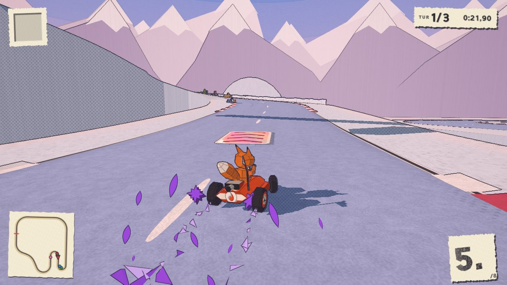
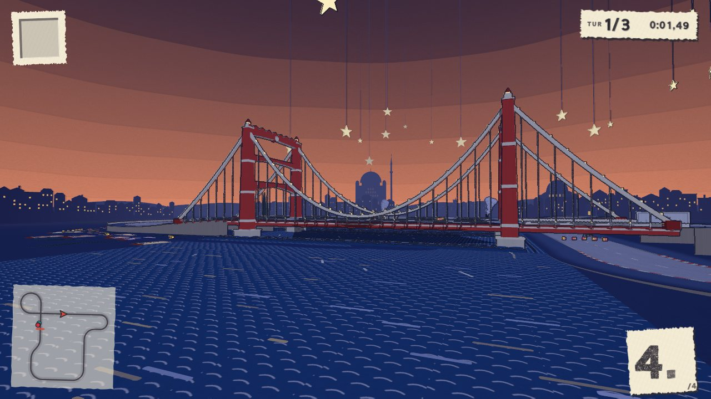
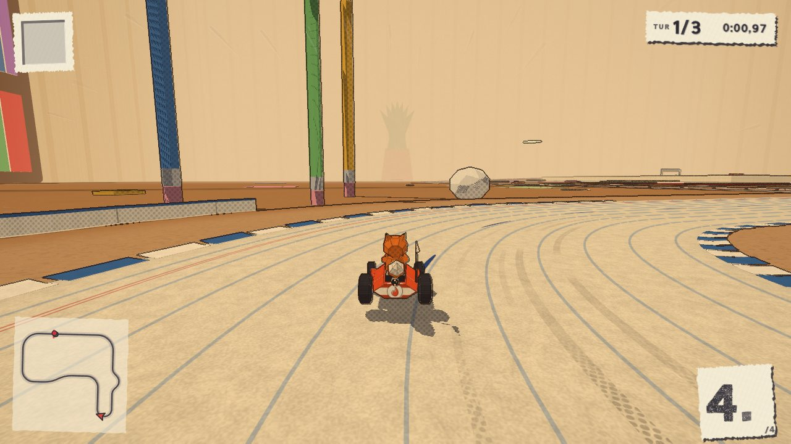
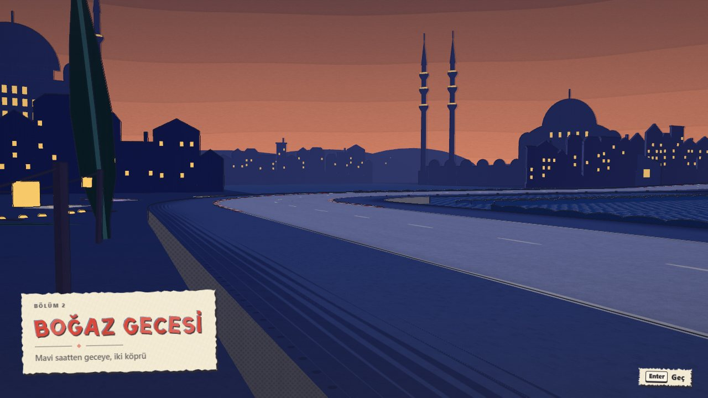
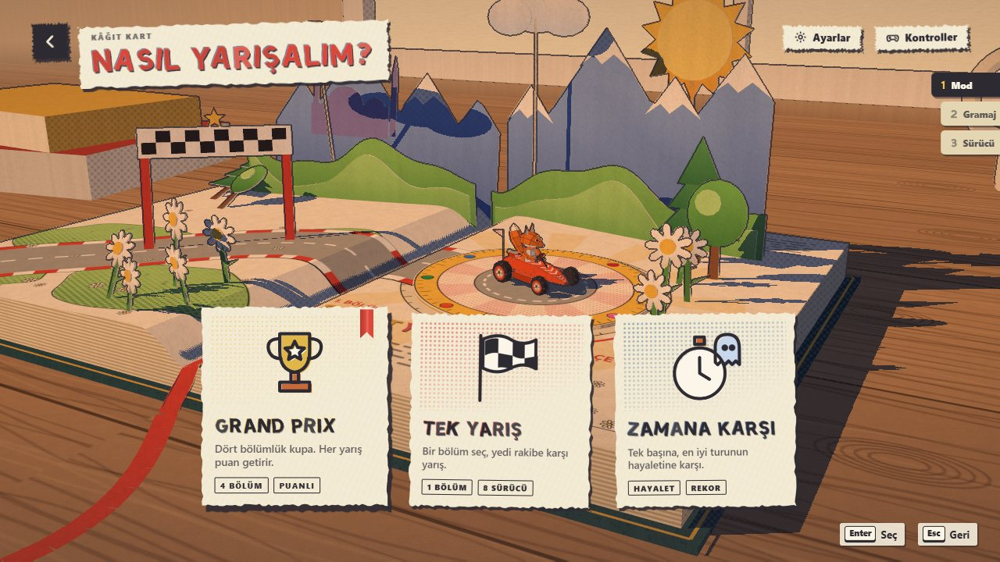
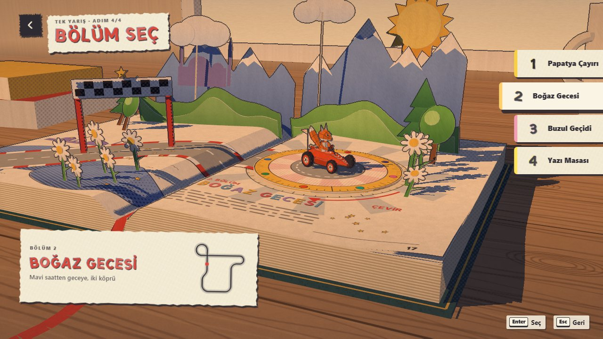
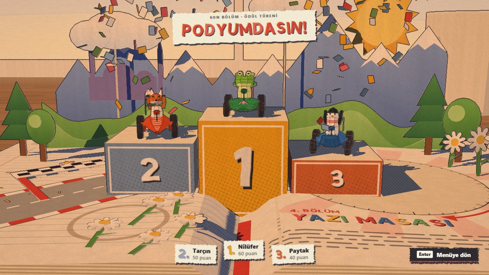
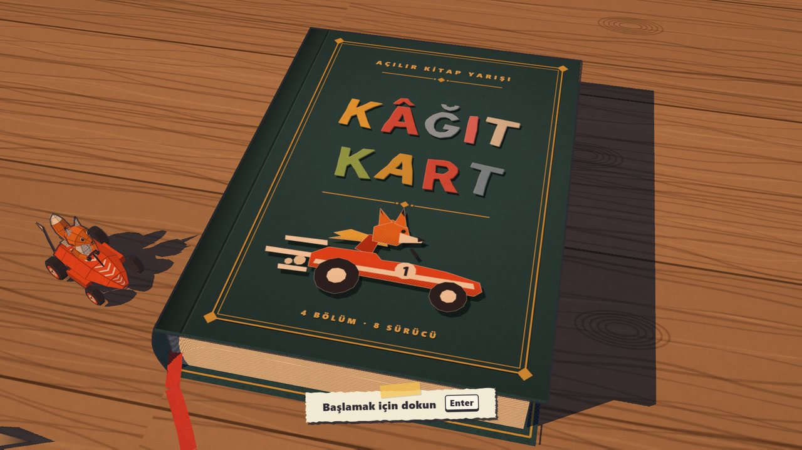

# Kâğıt Kart

[Play the game](https://burakerdemci.github.io/kagit-kart/) · [View source](https://github.com/BurakErdemci/kagit-kart)

| Overall rating | Screenshot score |
| :---: | :---: |
| **57/100** | **68/100** |

Read the scoring rationale

### Overall rating

Excluding the target, closest comparators are Gale Kart (54 overall: 8 tracks, 4 modes, 2 cups, replays, desktop builds but no verified runtime gameplay and no browser play), Sakura Rally (56: two stages plus open liaison world, campaign and replays, but no web play), Kart Royale (50/70 screenshots: complete single-track Three.js loop with verified HUD frames), Turbo Kart Rally (40/70: single-circuit procedural kart loop with 8 racers and items), and Wouf Kart (38/null: single-track prototype, no screenshots). Kâğıt Kart exceeds Kart Royale and Turbo on scope with 4 distinct chapters, 8 drivers/items, GP plus ghost time trial, 3 speed classes, procedural soundtrack and documented autopilot/low-end playtest tooling, plus a verified browser build and 4 inspected HUD gameplay frames. It trails moorestech (64, co-op server, modding, years of scale) and Meridian Wake (60) on multiplayer/systems breadth and proven live-ops scale, and sits just above Sakura Rally and Gale Kart on verified playability despite fewer tracks than Gale Kart. Evidence gaps: judged from repository/README/architecture/pages shell plus stills only; the live build was not played, so playability, performance, balance and actual rendered quality are not proven.

### Screenshot score

Four inspected racing frames show coherent pop-up-book/paper-cut styling across meadow, glacier, bridge and desk chapters with full Turkish HUD (lap, timer, minimap, position). Composition and variety are strong and clearly the game's own output. Below Kart Royale (70) and Turbo Kart Rally (70) on material detail, lighting richness and crowd/props density; on par with Sakura Rally (68) for stylization and above OSRS Tower Defense (65) for art coherence. Menus/title/podium discounted. Stills prove nothing about motion, performance or feel.

## At a glance

| Detail | Value |
| --- | --- |
| Repository created | 24 Sep 2026 · 05:10 UTC |
| Added to catalog | 29 Sep 2026 · 03:30 UTC |
| Last updated | 29 Sep 2026 · 03:30 UTC |
| Documented creation models | [Claude Opus 5.5](https://github.com/BurakErdemci/kagit-kart/blob/master/README.md) |

## Screenshots

Inspected downloaded copy: chase view behind orange fox kart at countdown 3 on Papatya Çayırı start straight, two rival karts ahead under checkered arch, daisies/houses/hills trackside, HUD with TUR 1/3 timer, minimap, 4th place. Coherent paper/cut-paper styling, full race HUD, game's own runtime output.

[Original screenshot](https://raw.githubusercontent.com/BurakErdemci/kagit-kart/master/docs/shots/meadow-grid.jpg)

Inspected downloaded copy: fox kart mid-drift on glacier track emitting purple paper shards/zaps, boost pad ahead, rivals in distance, snow mountains and tunnel, HUD with TUR 1/3 0:21.90, minimap, 5th/8. Dynamic gameplay frame, game's own output.

[Original screenshot](https://raw.githubusercontent.com/BurakErdemci/kagit-kart/master/docs/shots/glacier-drift.jpg)

Inspected downloaded copy: red paper-cut suspension bridge over cut-paper waves at dusk with mosque silhouette, star mobiles hanging above, HUD with TUR 1/3 0:01.49, minimap, 4th place. Scenic gameplay frame, game's own output; no karts visible in this still.

[Original screenshot](https://raw.githubusercontent.com/BurakErdemci/kagit-kart/master/docs/shots/bosphorus-bridge.jpg)

Inspected downloaded copy: fox kart cornering on ruled-notebook road across the desk chapter with giant pencils, paper ball and book props, HUD with TUR 1/3 0:00.97, minimap, 4th/4. Gameplay frame, game's own output.

[Original screenshot](https://raw.githubusercontent.com/BurakErdemci/kagit-kart/master/docs/shots/desk-notebook.jpg)

Inspected downloaded copy: Bosphorus dusk intro card for BÖLÜM 2 BOĞAZ GECESİ over empty quay road with lit mosque silhouettes and Enter/Geç prompt. Cinematic/intro view, no karts racing; discounted as non-race gameplay.

[Original screenshot](https://raw.githubusercontent.com/BurakErdemci/kagit-kart/master/docs/shots/bosphorus-skyline.jpg)

Inspected downloaded copy: mode-select menu NASIL YARIŞALIM over open pop-up book with fox kart on turntable, three cards for GRAND PRIX, TEK YARIŞ, ZAMANA KARŞI, plus Ayarlar/Kontroller buttons. Menu, not active racing; placed after gameplay.

[Original screenshot](https://raw.githubusercontent.com/BurakErdemci/kagit-kart/master/docs/shots/menu.jpg)

Inspected downloaded copy: track-select BÖLÜM SEÇ over pop-up book showing four chapters (Papatya Çayırı, Boğaz Gecesi, Buzul Geçidi, Yazı Masası) with minimap card. Menu, not active racing.

[Original screenshot](https://raw.githubusercontent.com/BurakErdemci/kagit-kart/master/docs/shots/track-select.jpg)

Inspected downloaded copy: podium ceremony PODYUMDASIN with three karts on 1-2-3 paper blocks under confetti, points list Tarçın/Nilüfer/Paytak. Results ceremony, not active racing.

[Original screenshot](https://raw.githubusercontent.com/BurakErdemci/kagit-kart/master/docs/shots/podium.jpg)

Inspected downloaded copy: closed cloth-bound book titled KÂĞIT KART with fox-kart illustration on wooden desk beside paper fox kart, with Başlamak için dokun/Enter prompt. Title card, not active racing; placed last.

[Original screenshot](https://raw.githubusercontent.com/BurakErdemci/kagit-kart/master/docs/shots/title.jpg)

## Play

- Open https://burakerdemci.github.io/kagit-kart/ on desktop or phone and click/tap through the title to unlock audio and focus the canvas.
- Choose Grand Prix (four-chapter cup), Tek Yarış (single race), or Zamana Karşı (time trial against your ghost), then paper-weight class 80g/120g/200g, driver and track.
- Accelerate with Up/W, steer with Left-Right/A-D, brake with Down/S; hold Space/Shift while steering to drift and release for tiered boost; fire items with X/E.
- Race 3 laps against 7 AI, use fountain-pen rockets, gum, paper planes, ink, shield and scissors, hit boost pads and ramps, avoid off-page falls, and finish for Grand Prix points or ghost records.
- On gamepad use left stick to steer, A/RT accelerate, B/LT brake, RB drift, X/LB item, Y look back, Start pause; on phone use the on-screen controls; Esc/P pauses, M mutes.

## Mechanics

- Pop-up-book kart racing across 4 print-style chapters with folding scenery
- 8 drivers with distinct stats and 8 stationery items including rockets, gum, planes, inkwell, shield and scissors
- Grand Prix cup, single race, and ghost time trial over 3 laps with 1 player plus 7 AI
- Paper-weight speed classes 80g, 120g and 200g
- Three-tier drift boosts plus slipstream, ramp tricks, boost pads and start boost
- Off-page falls recovered by paper crane, offroad slowdown and kart collisions
- Fully code-generated paper meshes, textures, lettering, synthesized SFX and sequenced chapter music with final-lap tempo rise
- Four quality levels with automatic resolution scaling from measured frame time

## Tags

- kart-racer
- racing
- 3d
- pop-up-book
- paper-craft
- threejs
- browser-game
- procedural-generation
- single-player
- ai-racers
- grand-prix
- time-trial
- turkish

## Controls

- Mobile controls: Supported
- Motion controls: Not established
- Gamepad: Supported
- Keyboard/mouse: Supported

## Player modes

- Human players: 1
- Modes: single-player

## Technologies

- **Three.js 0.186.0** — engine ([evidence](https://github.com/BurakErdemci/kagit-kart/blob/master/index.html))
- **JavaScript** — language ([evidence](https://api.github.com/repos/BurakErdemci/kagit-kart/languages))
- **Web Audio API** — audio ([evidence](https://github.com/BurakErdemci/kagit-kart/blob/master/README.md))

## Reconstructed prompt

Build Kâğıt Kart, a Turkish Mario-Kart-style 3D browser kart racer inside a pop-up book with Three.js 0.186.0 and zero asset files: all meshes, paper CanvasTextures, cut-paper letters and Web Audio music/SFX generated in code. 4 chapters (daisy meadow, Bosphorus dusk with bridge, glacier pass, ruled-notebook desk), 8 paper drivers with stats, 8 stationery items, Grand Prix plus single race plus ghost time trial, 80/120/200g speed classes, 3-tier drift boosts, slipstream, ramp tricks, boost pads, crane respawn, podium, folding-page scenery, procedural chapter themes, 4 quality levels with auto resolution, keyboard plus gamepad plus on-screen touch, fixed-step deterministic sim with Playwright autopilot playtests.

## Source evidence

- Repository BurakErdemci/kagit-kart is a public browser kart racer described as 'A kart racer inside a pop-up book. Every mesh, paper texture, letter and sound is generated by code; no asset files. Play in the browser.' with homepage https://burakerdemci.github.io/kagit-kart/, JavaScript-dominant, default branch master. ([source](https://github.com/BurakErdemci/kagit-kart))
- README defines the game as a pop-up-book kart racer with no asset files, one dependency (three.js via jsdelivr), 4 chapters, 8 drivers, 8 items, 3 modes, 3 speed classes, drift boosts, slipstream, ramps/tricks, procedural soundtrack, and quality levels. ([source](https://github.com/BurakErdemci/kagit-kart/blob/master/README.md))
- README play link points to https://burakerdemci.github.io/kagit-kart/ labeled 'Play it in your browser (desktop or phone, keyboard, gamepad or touch)'; live page returns the game shell with Kâğıt Kart boot text and #kk-root canvas host. ([source](https://burakerdemci.github.io/kagit-kart/))
- index.html is a page body with importmap pinning three to https://cdn.jsdelivr.net/npm/three@0.186.0/build/three.module.js and three/addons/ to the same 0.186.0 examples path, plus #kk-root canvas host and module src/main.js. ([source](https://github.com/BurakErdemci/kagit-kart/blob/master/index.html))
- ARCHITECTURE.md fixes the contract: Mario-Kart-style racer, 8 karts, 4 tracks, 3 laps, modes Grand Prix / Tek Yarış / Zamana Karşı with ghost, 8 items, 3-tier drift, tricks, slipstream, fixed ids for characters/tracks/items, and hard no-external-assets rule. ([source](https://github.com/BurakErdemci/kagit-kart/blob/master/ARCHITECTURE.md))
- Controls table documents keyboard bindings: steer arrows/A-D, accelerate/brake arrows/W-S, drift Space/Shift, item X/E, look back C, pause Esc/P, mute M; this establishes keyboard support. ([source](https://github.com/BurakErdemci/kagit-kart/blob/master/README.md))
- Same Controls table documents gamepad bindings: left stick steer, A/RT accelerate, B/LT brake, RB drift, X/LB item, Y look back, Start pause; this establishes gamepad support. ([source](https://github.com/BurakErdemci/kagit-kart/blob/master/README.md))
- README states 'On a phone, the game shows on-screen controls' and the play link advertises phone/touch; this establishes mobile touch controls as supported. ([source](https://github.com/BurakErdemci/kagit-kart/blob/master/README.md))
- No accelerometer, gyroscope, or device-motion controls are documented anywhere in the inspected README or architecture; motion support remains unknown rather than ruled out. ([source](https://github.com/BurakErdemci/kagit-kart/blob/master/README.md))
- Content is 8 karts described as 1 player + 7 CPU with 8 named drivers and 3 modes (four-chapter Grand Prix, single race, time trial against own ghost); no local or online human multiplayer is documented, so 1 human player single-player. ([source](https://github.com/BurakErdemci/kagit-kart/blob/master/README.md))
- How-it-was-made section attributes the build to owner Burak Erdemci briefing Claude Opus 5.5 in Claude Code with subagents, contract-first ARCHITECTURE.md, parallel feature lanes, QA agent with 27 issues, and five fix rounds; about 27,000 lines in 78 modules. ([source](https://github.com/BurakErdemci/kagit-kart/blob/master/README.md))
- No verified catalog match: local catalog Games section was read and games/ directory lists no BurakErdemci/kagit-kart entry; kart comparators inspected (Gale Kart, Kart Royale, Turbo Kart Rally, Sakura Rally, Wouf Kart) are different repositories with no shared playable URL or explicit project reference. ([source](https://github.com/BurakErdemci/kagit-kart))

## Fictional reviews

Treat these as illustrative, not real user reviews.

- 82/100: Fictional illustrative review one: the pop-up book folding up ahead of my fox kart is the most charming kart idea in the catalog, and four paper worlds with ghosts and Grand Prix points kept me racing past midnight.
- 60/100: Fictional illustrative review two: cute paper drifting and fun stationery items, but Turkish-only menus took translating and I still do not know how the 200g class balances against the AI on the glacier void.
- 100/100: Fictional illustrative review three: zero asset files and every daisy, mosque window and music bar generated in code, then a QA agent played it and filed 27 issues? As a code-only experiment this is delightful.

## Links

- [Original submission](https://burakerdemci.github.io/kagit-kart/)
- [Source repository](https://github.com/BurakErdemci/kagit-kart)
