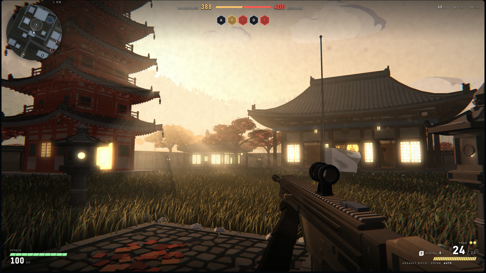
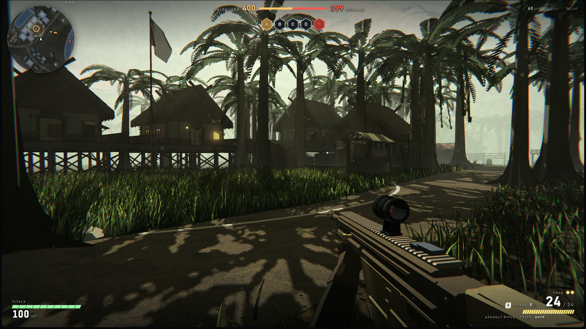
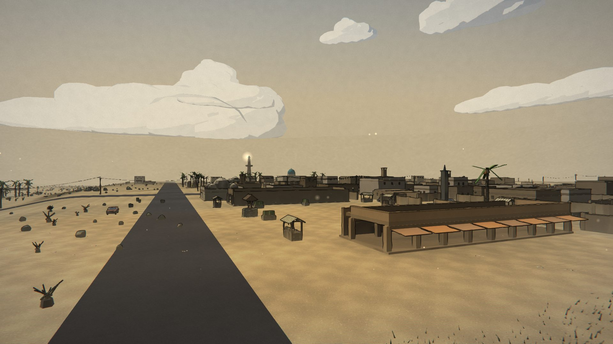

# GREYWATCH

[Play the game](https://greywatch-game.com) · [View source](https://github.com/greywatch-game/greywatch)

| Overall rating | Screenshot score |
| :---: | :---: |
| **62/100** | **77/100** |

Read the scoring rationale

### Overall rating

Greywatch sits just below catalog leader moorestech (64, ~15,500 commits of factory systems plus co-op and mods) and above Arkenfall (58, broad scope but unreleased with no verifiable build) and GunBros (57, polished but a narrow twin-stick loop). It exceeds Kart Royale (50, single polished track) on gameplay depth: a complete FPS conquest loop with 7 maps, 3 vehicle kinds, squad-AI bots, and an authoritative multiplayer server, all with coherent cel-shaded WebGPU visuals and full HUDs. Capped well below AAA because stills and docs cannot prove performance, balance, bot quality, or netcode; the WebGPU-only gate with no WebGL fallback limits reach; and known limitations (bots walk through corpses and parked hulls, fixed bindings, no lobby name box) remain.

### Screenshot score

All three HUD frames are the game's own runtime output with coherent cel-shaded art: warm lantern-lit interiors, detailed cobblestone/temple/palm environments, weapon viewmodels, minimaps, ticket bars and health/ammo HUDs. Exceeds catalog mid-tier (OSRS Tower Defense 65, Kart Royale / Turbo Kart Rally / Neural Sight 70) on lighting, scene detail and UI density, and matches moorestech (76) while sitting just under Arkenfall (78). The fourth frame is a HUD-less map vista/menu backdrop and is discounted. Still frames cannot prove motion, performance, or feel.

## At a glance

| Detail | Value |
| --- | --- |
| Repository created | 24 Aug 2026 · 06:54 UTC |
| Added to catalog | 04 Oct 2026 · 08:48 UTC |
| Last updated | 04 Oct 2026 · 08:48 UTC |
| Documented creation models | [Adobe Firefly](https://github.com/greywatch-game/greywatch/blob/main/README.md) |

## Screenshots

Inspected downloaded copy: first-person view in Harrowmead village green at sunset — church with spire, lit timber houses, market stalls, capture flag, cobblestone street, assault-rifle viewmodel with optic, minimap, A–E tickets (393 vs 373), 100 HP vitals, 24/24 ammo HUD. Game's own runtime output.

[Original screenshot](https://raw.githubusercontent.com/greywatch-game/greywatch/main/docs/screenshots/harrowmead.jpg)

Inspected downloaded copy: first-person view in Kurenai temple town — red pagoda, lantern posts, glowing temple windows, maple trees, tall grass, same rifle viewmodel and full conquest HUD (388 vs 400). Game's own runtime output.

[Original screenshot](https://raw.githubusercontent.com/greywatch-game/greywatch/main/docs/screenshots/kurenai.jpg)

Inspected downloaded copy: first-person view in Greyfen jungle valley — stilt houses, dense palms with dappled shadows, tall grass, dirt path, same rifle viewmodel and full conquest HUD (400 vs 399). Game's own runtime output.

[Original screenshot](https://raw.githubusercontent.com/greywatch-game/greywatch/main/docs/screenshots/greyfen.jpg)

Inspected downloaded copy: wide HUD-less desert-town vista of Sarab (menu-backdrop shot, no weapon or HUD) — road, low town blocks, minaret-like tower, windmill. Shows map art, not active gameplay; discounted.

[Original screenshot](https://raw.githubusercontent.com/greywatch-game/greywatch/main/shots/sarab.jpg)

## Play

- Open https://greywatch-game.com in a WebGPU-capable browser (Chrome or Edge anywhere, Safari 18+, Firefox on Windows) over HTTPS or localhost.
- Pick single-player from the main menu to fight bots alone, or open Multiplayer (M) to list matches on a match server.
- Choose a map and start a fresh match, or join a running match on whatever map it is playing.
- Fight over the five control points A–E to drain the enemy ticket count (both sides start near 400).
- After each round, vote between three maps during the eight-second pause before the next round starts.

## Mechanics

- Conquest over five control points (A–E) with per-side ticket counts
- First-person shooter combat against squad-planning bots on a precomputed nav grid with flow fields
- Authoritative dedicated Node match server with client-side hit-flash guesses re-simulated server-side
- Three drivable vehicle kinds: tank, gun truck, and helicopter (two seats, no passengers)
- Two weapon slots plus six optics, procedural viewmodel, reload, grenades (frag, RPG)
- Crouch (hold Ctrl or toggle C / gamepad B) that lowers eye position and breaks bot line-of-sight
- Map vote between three maps in the eight-second intermission; rotation wins ties and no-votes
- Reconnect support that rejoins the same match in any free slot
- Seven maps from fog-drowned night village to 1500 m volcanic island; 8v8, or 24-a-side on Sarab and Cinderhaven
- Cosmetic Havok ragdolls, shattering glass, and blast rubble

## Tags

- fps
- shooter
- conquest
- online-multiplayer
- single-player
- bots
- vehicles
- cel-shaded
- low-poly
- browser
- pwa
- webgpu

## Controls

- Mobile controls: Supported
- Motion controls: Supported
- Gamepad: Supported
- Keyboard/mouse: Supported

## Player modes

- Human players: 1-16
- Modes: single-player, online multiplayer

## Technologies

- **Babylon.js ^9.28.0** — engine ([evidence](https://github.com/greywatch-game/greywatch/blob/main/package.json))
- **Havok ^1.3.14** — physics ([evidence](https://github.com/greywatch-game/greywatch/blob/main/package.json))
- **TypeScript ^5.8.3** — language ([evidence](https://github.com/greywatch-game/greywatch/blob/main/package.json))
- **WebGPU** — rendering ([evidence](https://github.com/greywatch-game/greywatch/blob/main/README.md))
- **Vite ^6.3.5** — build ([evidence](https://github.com/greywatch-game/greywatch/blob/main/package.json))
- **Node.js \>=24** — framework ([evidence](https://github.com/greywatch-game/greywatch/blob/main/package.json))
- **ws ^8.21.3** — framework ([evidence](https://github.com/greywatch-game/greywatch/blob/main/package.json))
- **Web Audio** — audio ([evidence](https://github.com/greywatch-game/greywatch/blob/main/README.md))

## Reconstructed prompt

Build a browser-based cel-shaded first-person Conquest shooter in TypeScript and Babylon.js with WebGPU rendering: 7 low-poly ink-outlined maps, 5 capture points with ticket bleed, squad-AI bots, tanks/trucks/helicopters, 2 weapon slots with 6 optics, an authoritative Node multiplayer server with Docker deploy, touch controls with gyro aim, and a PWA installable client. Deploy a playable demo at greywatch-game.com.

## Source evidence

- Browser-based Conquest FPS in first person against bots, alone or with other people on a match server; two sides fight over five control points on seven maps, 8v8 or 24-a-side on the two biggest maps. ([source](https://github.com/greywatch-game/greywatch/blob/main/README.md))
- Match has sixteen seats for people (eight a side); empty seats are bots; Sarab and Cinderhaven field 24 a side of which at most 16 are people; matches can be created with bots off. ([source](https://github.com/greywatch-game/greywatch/blob/main/README.md))
- Official homepage serves the installable game (title, manifest, boot screen); it returned HTTP 200 and is the repo's declared homepage. ([source](https://greywatch-game.com))
- Unified keyboard/mouse + gamepad input (Xbox/PlayStation standard mapping); reload on R / gamepad X, grenade on G / gamepad RB, crouch on Ctrl hold or C / pad B toggle; mouse deltas and pointer lock handled in InputManager. ([source](https://github.com/greywatch-game/greywatch/blob/main/src/core/InputManager.ts))
- On-screen touch controls with a movement stick are polled by InputManager once per frame exactly as a gamepad is; touch layout, look sensitivity and stick shape live in config/touch.ts. ([source](https://github.com/greywatch-game/greywatch/blob/main/src/config/touch.ts))
- GyroInput implements phone-rotation aim from the devicemotion gyroscope, polled by InputManager once per frame; Game.applySettings toggles it per player setting. ([source](https://github.com/greywatch-game/greywatch/blob/main/src/core/GyroInput.ts))
- Requires Node 24+ and a WebGPU-capable browser with no WebGL fallback; boot screen checks for a GPU adapter. Rendering is hand-written WGSL cel shading with 16 dynamic point lights in one shadow atlas, cloud shadows, and compute-traced bounce light. ([source](https://github.com/greywatch-game/greywatch/blob/main/README.md))
- Bots steer on a precomputed nav grid with one flow field per objective and plan as squads; the one physics engine is Havok (ragdolls, glass, rubble) and it is required at boot. ([source](https://github.com/greywatch-game/greywatch/blob/main/README.md))
- Known limitations: primitive-assembly characters with procedural animation, cosmetic-only ragdolls, bots walk through corpses and parked vehicles, fixed bindings, no audio settings page, non-customisable touch layout. ([source](https://github.com/greywatch-game/greywatch/blob/main/README.md))
- Catalog check: no existing games/\<slug\>/ directory matches greywatch-game/greywatch by repository, playable URL, or project reference, so this is a new catalog entry (catalog\_slug null). ([source](https://github.com/SubmitGame/.github/blob/main/README.md))

## Fictional reviews

Treat these as illustrative, not real user reviews.

- 85/100: The evening assault on Harrowmead genuinely stopped me mid-push — lantern light spilling across cobblestones while ticket counts tick down is Battlefield tension rendered in ink lines. Bots flank like they mean it.
- 62/100: Ambitious and handsome, but the WebGPU-only gate locked out two of my machines and the bots still march through parked tanks and corpses. When it runs, it sings; getting it running is the boss fight.
- 100/100: Seven hand-tuned maps, drivable tanks and helicopters, squad-planning bots, and a whole match server in one repo — the most complete browser FPS package I have ever deployed with docker compose up.

## Links

- [Source repository](https://github.com/greywatch-game/greywatch)
- [Play the game](https://greywatch-game.com)
