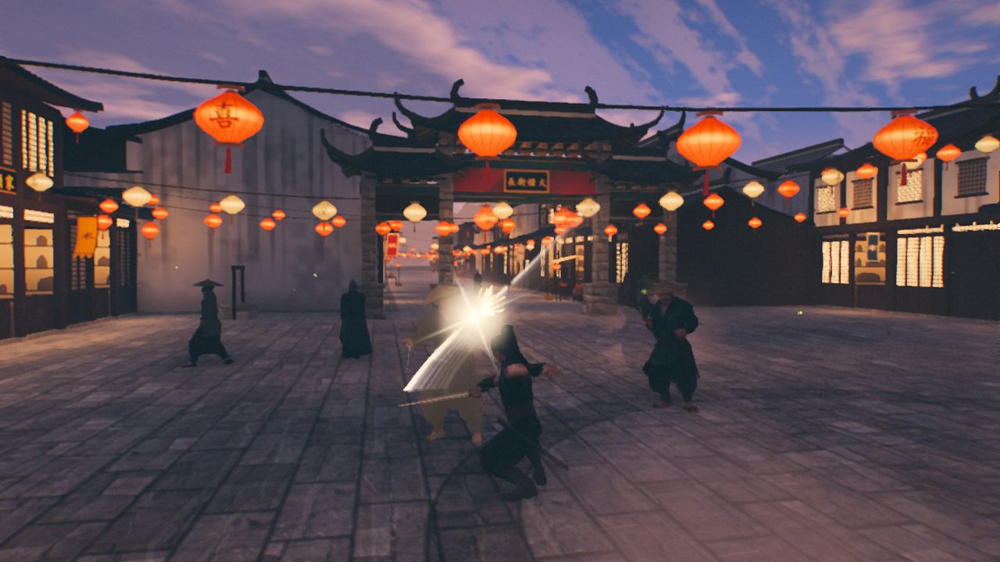

# 长风 · Long Wind

[Play the game](https://jbang2004.github.io/long-wind/) · [View source](https://github.com/jbang2004/long-wind)

| Overall rating | Screenshot score |
| :---: | :---: |
| **62/100** | **74/100** |

Read the scoring rationale

### Overall rating

Excluding itself, closest comparators are moorestech (64 overall, catalog top with co-op, mods and years of systems depth), Meridian Wake (60, playable three.js browser game with campaign and touch plus gamepad), LUMENRIFT (58, complete polished loop with 68 screenshots), GunBros (57) and Emberwake (53/70, complete single-loop survivors-like). Long Wind sits above Meridian Wake and LUMENRIFT on verified combat depth (parry, i-frames, posture/executions, lock-on, five enemy types, three bosses), three distinct hand-built biomes with reactive crowds, and inspected cinematic lighting, plus touch support and headless tests. It sits below moorestech because it is single-player only with no multiplayer, mods or live-ops, built in about a day of AI time, and screenshots plus docs cannot prove playability, performance or balance.

### Screenshot score

All three inspected frames are the game's own three.js output with coherent stylized realism, strong sky, weather and lantern lighting, and real combat staging. Above DRIFTWING (72, atmospheric glider stills with no HUD or combat) and Emberwake/Kart Royale/Turbo Kart Rally (70, polished but smaller-scope loops) on scene variety and combat density across three distinct biomes, but below moorestech (76, densest HUD-heavy multi-system 3D) because no HUD, damage numbers or menus are visible in these stills. Stills cannot prove motion, performance or feel.

## At a glance

| Detail | Value |
| --- | --- |
| Repository created | 26 Sep 2026 · 00:41 UTC |
| Added to catalog | 29 Sep 2026 · 03:30 UTC |
| Last updated | 29 Sep 2026 · 03:30 UTC |
| Documented creation models | [Claude Opus 5.5](https://github.com/jbang2004/long-wind), [Tripo AI](https://github.com/jbang2004/long-wind/blob/main/CREDITS.md) |

## Screenshots

Inspected downloaded copy: golden-hour steppe duel in tall wind-blown grass, bright sun with haze, lone tree and mountains, three dark-robed swordsmen mid-fight with one lunging and red health cue visible; coherent wuxia lighting and dense grass detail, the game's own runtime output

[Original screenshot](https://github.com/jbang2004/long-wind/raw/main/docs/media/steppe.jpg)

Inspected downloaded copy: lantern-lit canal-town street at dusk with red and white lantern strings, paifang gate, stone paving, swordsman unleashing bright arcing sword flash against multiple robed enemies; clear combat action and festive architecture, the game's own runtime output

[Original screenshot](https://github.com/jbang2004/long-wind/raw/main/docs/media/town.jpg)

Inspected downloaded copy: rainy night bamboo forest with streaking rain, mist, reflective puddles, glowing stone lanterns, bamboo silhouettes and two distant figures under moonlit clouds; atmospheric but darker and softer than the other two, the game's own runtime output

[Original screenshot](https://github.com/jbang2004/long-wind/raw/main/docs/media/bamboo.jpg)

## Play

- Open https://jbang2004.github.io/long-wind/ in desktop Chrome or Edge with WebGL; use ?level=steppe\|bamboo\|town to jump chapters, ?q=low\|med\|high for quality, ?demo=1 for AI auto-fight
- Move with WASD, look with mouse, sprint with Shift, dodge with Space
- Attack with left mouse (hold for heavy), block with right mouse and time it for a perfect parry, fire sword qi with E, lock on with Q or Tab, draw or sheath with F
- Break enemy posture for executions; dodge through hits with i-frames; knock down or launch foes
- On phones or tablets play landscape: push anywhere on the left half for the floating stick (past rim to sprint), drag right half to look, tap strike/dodge/block/qi/lock/draw buttons
- Pause with Esc to change quality or chapter; press H to hide HUD, O for orbit camera, T for slow motion when recording

## Mechanics

- Third-person real-time sword combat with light/heavy chains, charged heavies, hit-stop, screen shake and directional hits
- Block with perfect-parry window, dodge with invincibility frames, sprint, jump-slash and rolling aerial cuts
- Posture and stance-break system with executions, launches, knockdowns and get-ups
- Sword-qi projectile, target lock-on, five enemy types including archers, shieldmen, spearmen and assassins
- Three chapters with distinct bosses: steppe duel, stealth teleporting assassin in rain, lantern-town finale with reactive civilian AI
- Procedural open environments: wind-blown grass, rain with lightning and puddle reflections, 500-lantern canal town with river and bridges
- Fully synthesized WebAudio score and effects with no audio files; TAA upscaling and low/med/high quality tiers

## Tags

- wuxia
- action
- third-person
- sword-combat
- threejs
- webgl
- browser
- procedural
- single-player
- ai-generated

## Controls

- Mobile controls: Supported
- Motion controls: Not established
- Gamepad: Not established
- Keyboard/mouse: Supported

## Player modes

- Human players: 1
- Modes: single-player

## Technologies

- **three ^0.186.0** — engine ([evidence](https://github.com/jbang2004/long-wind/blob/main/package.json))
- **WebGL** — rendering ([evidence](https://github.com/jbang2004/long-wind))
- **JavaScript** — language ([evidence](https://github.com/jbang2004/long-wind/blob/main/package.json))
- **WebAudio** — audio ([evidence](https://github.com/jbang2004/long-wind))
- **Vite ^8.3.0** — build ([evidence](https://github.com/jbang2004/long-wind/blob/main/package.json))

## Reconstructed prompt

Build a real-time third-person wuxia action game in the browser with three.js and Vite: a lone swordsman across three chapters (golden steppe, rainy night bamboo forest, lantern canal town with fleeing townsfolk), light/heavy combos, block with perfect parry, dodge i-frames, posture breaks and executions, sword qi, lock-on, five enemy types plus three bosses, procedural terrain/grass/weather/town, Mixamo-retargeted motion with IK fixes, fully synthesized WebAudio music and SFX, keyboard/mouse plus ink-style touch controls, quality tiers and demo/record URL modes, and GitHub Pages deployment.

## Source evidence

- Repository page describes an actual real-time wuxia action game in the browser with three.js: a swordsman across three chapters with light/heavy combos, parries, dodges, posture breaks, executions and five enemy types plus bosses ([source](https://github.com/jbang2004/long-wind))
- README lists three chapters: golden-hour steppe with boss 断刀客, rainy night bamboo forest with stealth boss 夜枭, and lantern-lit canal town with townsfolk AI and boss 寒山客 ([source](https://github.com/jbang2004/long-wind))
- README documents keyboard and mouse controls: WASD move, mouse look, left-click slash (hold for heavy), right-click block with perfect parry window, Space dodge, Shift sprint, Q/Tab lock-on, E sword qi, F draw/sheath, Esc pause ([source](https://github.com/jbang2004/long-wind))
- README documents mobile touch controls: floating left thumb-stick on left half (push past rim to sprint), right-side drag to look, on-screen buttons for strike/dodge/block/qi/lock/draw, landscape recommended, ?touch=1 forces them ([source](https://github.com/jbang2004/long-wind))
- No accelerometer, gyroscope, or device-motion controls are documented; motion support is unestablished ([source](https://github.com/jbang2004/long-wind))
- No gamepad bindings are documented in controls, URL params, or record-mode sections; gamepad support is unestablished rather than explicitly ruled out ([source](https://github.com/jbang2004/long-wind))
- Game is single-player: one lone swordsman versus AI enemies, archers, shieldmen, spearmen, assassins, bosses and fleeing townsfolk; no multiplayer, lobby, co-op or netcode documented ([source](https://github.com/jbang2004/long-wind))
- package.json declares three ^0.186.0 runtime dependency and vite ^8.3.0 plus playwright-core dev dependencies, type module, and scripts for dev/build/test ([source](https://github.com/jbang2004/long-wind/blob/main/package.json))
- vite.config.js uses Vite with base './' for GitHub Pages, es2022 target, dev server on 127.0.0.1:5173 ([source](https://github.com/jbang2004/long-wind/blob/main/vite.config.js))
- index.html is a browser game shell with canvas#c, HUD overlay, Chinese loading screen, Google Fonts, and module entry /src/main.js ([source](https://github.com/jbang2004/long-wind/blob/main/index.html))
- README states zero audio files: music, impacts, rain, thunder, voices and crowd noise synthesized live with WebAudio; CREDITS confirms procedural terrain, grass, bamboo, town, sky, weather and townsfolk with no audio files ([source](https://github.com/jbang2004/long-wind/blob/main/CREDITS.md))
- README attributes every line of code to Claude Opus 5.5 in Claude Code, with ~38,000 lines of JS/GLSL in 151 files, one runtime dependency, 30 headless gameplay tests, and timeline Sep 24-27 ([source](https://github.com/jbang2004/long-wind))
- CREDITS attributes character models to Tripo AI image/text-to-3D and motion capture to Adobe Mixamo, converted and retargeted by tools, with Poly Haven CC0 textures and procedural everything else ([source](https://github.com/jbang2004/long-wind/blob/main/CREDITS.md))
- Play URL returns the live game shell with title 长风, subtitle 天苍苍 · 野茫茫 and seal button, verifying a publicly reachable playable game rather than a repo or promo page ([source](https://jbang2004.github.io/long-wind/))
- gh api could not be used in this runner because gh CLI requires GH\_TOKEN which was absent; repository evidence was verified via fetched GitHub pages and raw file views instead without cloning source code ([source](https://github.com/jbang2004/long-wind))
- Local catalog at games/ contains no jbang2004/long-wind entry; no verified repository, playable URL or explicit project-reference match exists, so no existing slug is reused ([source](https://github.com/jbang2004/long-wind))

## Fictional reviews

Treat these as illustrative, not real user reviews.

- 85/100: The steppe at sunset stopped me cold — grass hissing in the wind, then a perfect parry that actually felt earned. Three chapters in a browser tab should not look this good.
- 62/100: Real combat ideas and gorgeous weather, but the camera and lock-on need taming and the middle chapter drags. A thrilling demo of AI craft rather than a finished classic.
- 100/100: Parried the night assassin mid-teleport, launched a spearman into a lantern crowd, townsfolk scattering — pure wuxia cinema. The most ambitious browser sword game here.

## Links

- [Original submission](https://jbang2004.github.io/long-wind/)
- [Source repository](https://github.com/jbang2004/long-wind)
