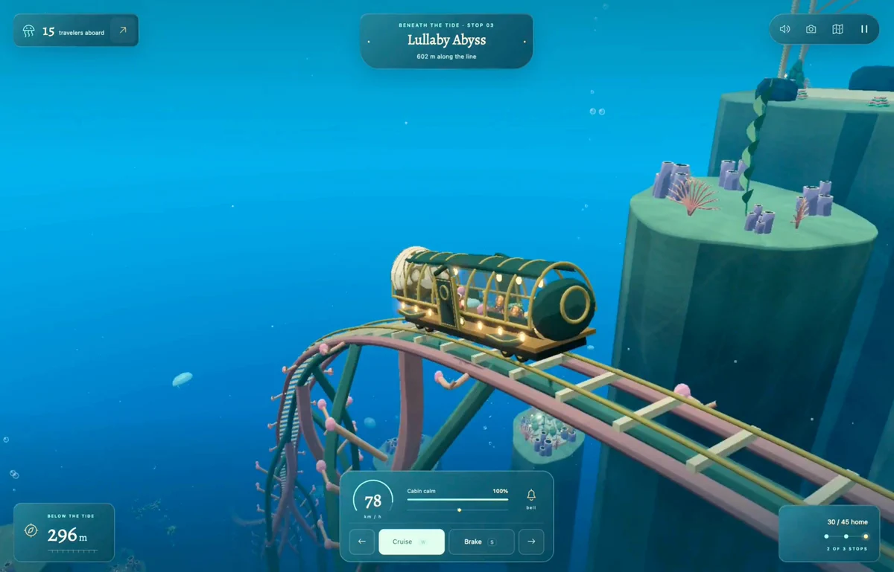
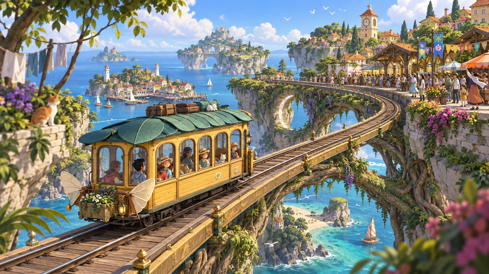

# Last Train to the Sea

[Play the game](https://app.usecrayon.ai/play/bda1b910-b840-48cb-bb4c-28d0cde29107) · [View original submission](https://app.usecrayon.ai/play/bda1b910-b840-48cb-bb4c-28d0cde29107)

No verified source repository.

| Overall rating | Screenshot score |
| :---: | :---: |
| **52/100** | **62/100** |

Read the scoring rationale

### Overall rating

Excluding itself, closest comparators are Emberwake (53 overall/70 screenshots: complete survivors loop with upgrades and boss), DRIFTWING (52/72: ambient infinite 3D flight with weather/day-night, no fail state), Kart Royale (50/70: polished single-track 3D racer), Sakura Rally (56/68: deep rally package with stages/open world/garage), Meridian Wake (60/68: broad systems trader with touch+gamepad) and catalog top moorestech (64/76: verified multiplayer factory sim). Last Train to the Sea sits above Kart Royale on systems scope (five towns, passengers, tips, calm meter, lanterns, tickets, decorations, day/night) and near DRIFTWING/Emberwake on a complete cozy loop with verified playable URL and thousands of arcade plays, but below Sakura Rally and Meridian Wake on verified depth, source-backed tech, and controls breadth, and far below moorestech and AAA on content, multiplayer, and live-ops. Evidence gaps: no source repo, no interactive playtest beyond page metadata and stills, performance/balance/bell and decoration systems unverified.

### Screenshot score

Best frame is the game's own Three.js runtime output with coherent cozy stylized art, soft underwater lighting, readable tram/track composition and a complete dense HUD. Below catalog 70s Emberwake, Kart Royale, Turbo Kart Rally and Neural Sight and 68s Meridian Wake/Sakura Rally/GunBros on scene density and detail — the water is largely empty and platforms/corals are simple — and below OSRS Tower Defense (65) on density, but above THORNMERE and HEX DANMAKU (60) on 3D depth and full HUD, and well above Taipo (55) and flat DOM games. Cover art is prettier but curated reference and discounted. Stills prove nothing about motion, performance, or feel.

## At a glance

| Detail | Value |
| --- | --- |
| Added to catalog | 29 Sep 2026 · 03:30 UTC |
| Last updated | 29 Sep 2026 · 03:30 UTC |
| Documented creation models | Not established |

## Screenshots

Inspected copy: actual low-poly 3D gameplay underwater — glass-roofed green/gold tram on pink elevated rails curving past flat-topped rock platforms with simple corals, blue water with light rays and bubbles, full HUD with 15 travelers aboard, Lullaby Abyss stop 03, 78 km/h, Cabin calm 100%, Cruise W / Brake S buttons, 296m depth and 2 of 3 stops. The game's own runtime output; put first as best gameplay evidence.

[Original screenshot](https://pbs.twimg.com/amplify_video_thumb/2102545801369317376/img/ECqzP3CKOJlMIc6R?format=webp&name=medium)

Inspected copy: high-detail Ghibli-style key/cover art — yellow fairy tram with leaf roof and butterfly wings full of passengers crossing a vine-covered viaduct between Mediterranean cliff towns, lighthouse, sailboats, crowds on the platform. Rich painterly detail with no gameplay HUD; curated promotional reference, not in-engine output; discounted for graphics scoring, put second.

[Original screenshot](https://gamebuilderapi-thumbnailbucket3bc05c46-njaxbgcn5duh.s3.ap-south-1.amazonaws.com/bda1b910-b840-48cb-bb4c-28d0cde29107/hearthwing-e42752a34305/assets/runtime-v16/full/ticket-v1-hearthwing.webp)

## Play

- Open the play URL in a browser or on a phone.
- Board travelers and depart the station on the elevated line.
- Hold Cruise (W) to accelerate and press Brake (S) or on-screen arrows/buttons to slow for stops and curves.
- Keep Cabin calm high for comfortable journeys and better tips.
- Complete stops along the line toward home; three rescue lanterns protect against failures.
- Collect tickets and unlock decorations across five towns and day/night scenery.

## Mechanics

- Drive fairy tram Hearthwing on elevated underwater/cloud rails
- Cruise/Brake speed management with km/h readout
- Cabin-calm/comfort meter tied to tips
- Traveler pickup and aboard count (e.g. 15 travelers aboard)
- Multi-stop line progression (e.g. Lullaby Abyss stop 03, 2 of 3 stops)
- Three rescue lanterns as lives/safety net
- Distance/along-the-line and depth HUD
- Five lively towns and multiple maps
- Day and night scenery
- Collectible tickets and unlockable decorations

## Tags

- train-sim
- driving
- cozy
- ghibli
- underwater
- 3d
- low-poly
- single-player
- browser
- threejs

## Controls

- Mobile controls: Supported
- Motion controls: Not established
- Gamepad: Not established
- Keyboard/mouse: Supported

## Player modes

- Human players: 1
- Modes: single-player

## Technologies

- **Three.js** — engine ([evidence](https://x.com/aniketjart/status/2102546641253478674))

## Reconstructed prompt

Build a cozy Ghibli-style 3D underwater train sim in Three.js called Last Train to the Sea: drive the fairy tram Hearthwing across elevated rails through five towns, pick up travelers, balance wings/cabin calm with Cruise/Brake speed control, earn tips for comfortable driving, 3 rescue lanterns as lives, multiple stops per line with distance HUD, day/night scenery, collectible tickets and unlockable decorations, one-hand phone controls plus W/S keyboard controls, Crayon-hosted browser build.

## Source evidence

- X post by @aniketjart describes a 'ghibli-themed underwater train sim game' built/updated with Opus 5.5 and '@usecrayon with threejs' and links play maps to app.usecrayon.ai/play/bda1b910-b840-48cb-bb4c-28d0cde29107 ([source](https://x.com/aniketjart/status/2102546641253478674))
- Play page HTML titles the game 'Last Train to the Sea — Crayon' with og:title 'Last Train to the Sea' ([source](https://app.usecrayon.ai/play/bda1b910-b840-48cb-bb4c-28d0cde29107))
- Play page og:description documents the loop: 'Drive Hearthwing, a fairy tram, through five lively towns above the clouds. Balance its wings, collect travelers, and earn tips for a comfortable journey. Three rescue lanterns keep everyone safe. Day and night scenery, collectible tickets, unlockable decorations, and one-hand phone controls.' ([source](https://app.usecrayon.ai/play/bda1b910-b840-48cb-bb4c-28d0cde29107))
- Crayon arcade lists 'Last Train to the Sea' with ~2.4K-3.7K plays and the same Hearthwing/five-towns description, confirming a publicly listed playable game rather than only a promo image ([source](https://usecrayon.ai/))
- Inspected gameplay still shows in-engine HUD: 'Lullaby Abyss' stop 03, '15 travelers aboard', '602 m along the line', speed '78 km/h', 'Cabin calm 100%', 'Cruise W' and 'Brake S' buttons with left/right arrows, '296 m', '30 / 45 home' and '2 of 3 stops' — establishing keyboard W/S plus arrow/button input and a single-player driving loop with no multiplayer lobby ([source](https://pbs.twimg.com/amplify_video_thumb/2102545801369317376/img/ECqzP3CKOJlMIc6R?format=webp&name=medium))
- Play page description explicitly states 'one-hand phone controls', establishing mobile touch support ([source](https://app.usecrayon.ai/play/bda1b910-b840-48cb-bb4c-28d0cde29107))
- No verified GitHub repository is linked from the X post or the Crayon play page; the game is Crayon-hosted with no source URL established. \`gh api\` could not be used for repository verification because no GH\_TOKEN is available in this environment ([source](https://app.usecrayon.ai/play/bda1b910-b840-48cb-bb4c-28d0cde29107))
- No accelerometer, gyroscope, device-motion, or gamepad support is documented on the inspected play page or post; motion and gamepad status are unestablished rather than explicitly ruled out ([source](https://app.usecrayon.ai/play/bda1b910-b840-48cb-bb4c-28d0cde29107))
- Local catalog search found no existing games/ entry for 'Last Train to the Sea', 'Hearthwing', or play ID bda1b910; only an analysis-log mention exists, so no catalog\_slug match by verified repository, playable URL, or explicit project reference ([source](https://x.com/aniketjart/status/2102546641253478674))

## Fictional reviews

Treat these as illustrative, not real user reviews.

- 78/100: Fictional illustrative review: I eased Hearthwing into Lullaby Abyss at 78 with cabin calm at 100% and the tip chime made the whole slow ride worth it. The underwater light and rattling lanterns are pure cozy Ghibli.
- 55/100: Fictional illustrative review: Lovely five-town loop and the brake-or-miss stops keep you honest, but runs feel gentle rather than deep — I want timetables, upgrades, or weather before I reride nightly.
- 95/100: Fictional illustrative review: The most charming browser tram sim here — fifteen travelers aboard, fairy wings fluttering, tickets to chase and a glowing abyss below. One-hand phone play is perfect bedtime gaming.

## Links

- [Original submission](https://app.usecrayon.ai/play/bda1b910-b840-48cb-bb4c-28d0cde29107)
- [Crayon platform](https://usecrayon.ai/)
- [Original submission](https://x.com/aniketjart/status/2102546641253478674)
