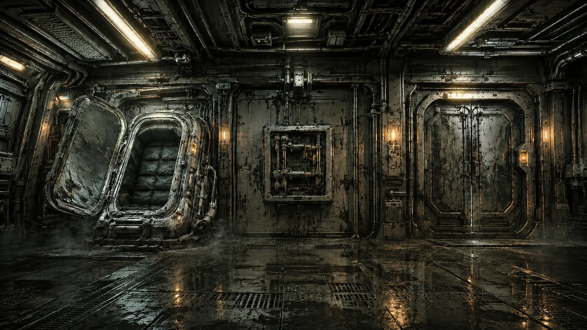
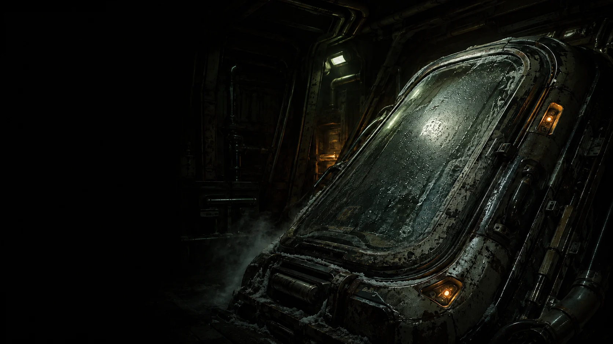

# DERELICT

[Play the game](https://derelict-game.vercel.app/) · [View original submission](https://derelict-game.vercel.app/)

No verified source repository.

| Overall rating | Screenshot score |
| :---: | :---: |
| **57/100** | **72/100** |

Read the scoring rationale

### Overall rating

A complete narrative escape game: 10 explorable compartments, 3 chapters/acts, seeded puzzles, saves, New Game Plus and 5 documented endings, plus a genuinely novel WebMCP human-plus-AI control split and per-room generative audio. That scope and polish places it above catalog narrative peers such as Deep Dive (50) and THORNMERE (46) and near Emberwake (53), but below the catalog topper moorestech (64) whose systemic multiplayer factory depth exceeds this mostly text-and-hotspot puzzle loop. Gaps: full puzzle chain, all endings, performance and balance were not verified in one session, and no public source repository was established, so playability beyond the verified cryo-bay loop is reported, not proven.

### Screenshot score

Inspected cryo-bay scene art is highly polished: coherent grimy industrial style, dense pipework and wear detail, motivated amber lighting with wet floor reflections, and composed wide shots that read as explorable space. That puts it level with catalog peers DRIFTWING (72) and Emberwake (70) and well above Deep Dive (55) and THORNMERE (60), but below moorestech (76) which shows denser systemic gameplay detail. Score reflects still-image polish and composition only; motion, UI feel and puzzle quality are not inferred.

## At a glance

| Detail | Value |
| --- | --- |
| Added to catalog | 29 Sep 2026 · 03:30 UTC |
| Last updated | 29 Sep 2026 · 03:30 UTC |
| Documented creation models | Not established |

## Screenshots

Wide cryo-bay gameplay backdrop: open frosted pod on the left, central wall grille/panel, lit corridor doorway on the right, grimy pipes, amber sconces and reflective wet deck plating.

[Original screenshot](https://derelict-game.vercel.app/assets/cryo-room-open-B2Yi1D2S.webp)

Alternate cryo-bay power-state backdrop: same compartment with the corridor sealed behind heavy double doors, identical industrial detailing and lighting.

[Original screenshot](https://derelict-game.vercel.app/assets/cryo-room-powered-4BxHxCzC.webp)

Inspectable in-game photo prop (Okafor's photograph hotspot): sunset beach silhouette of a child on an adult's shoulders.

[Original screenshot](https://derelict-game.vercel.app/assets/family-photo-DCp65fHc.jpg)

Title-screen opening backdrop: close-up of a frost-covered cryo pod in a dark bay with vapor and amber indicator lamps; used behind the DERELICT menu, so scored as title art rather than gameplay.

[Original screenshot](https://derelict-game.vercel.app/assets/opening-cryo-D_cv3Gcp.webp)

## Play

- Open https://derelict-game.vercel.app/ in a desktop browser and choose WAKE UP from the DERELICT title menu.
- Read HOW TO PLAY first: you handle everything physical (buttons, levers, valves, codes you find), while your AI agent operates ship systems through its tool link.
- For the full two-crew game, open the page where your AI agent can reach it (ChatGPT app browser works out of the box; desktop Chrome 149+ needs chrome://flags/#enable-webmcp-testing); solo walking without the link is still possible but quiet.
- In the cryo bay, inspect hotspots such as the P-7 aux grille and Okafor's photograph, restore auxiliary power, and use the deck map and AUX LINK bar to track which AI tools come online.
- Talk to your AI like a crewmate: describe what you see, relay codes and gauge readings aloud, and perform the physical move after it unlocks the next door or system.

## Mechanics

- Asymmetric two-crew co-op: human performs physical interactions while the AI agent calls ship-system tools over a WebMCP model-context link
- First-person room exploration across 10 compartments (cryo bay, engineering, bridge, medbay, crew quarters, hydroponics, cargo bay, reactor room, core vault, comms array) via deck map
- Power management and engineering puzzles: auxiliary power, fuses, coupling gear, coil phases, coolant valves, schematics and diagnostics
- Investigation chain: crew logs, medbay records, safes, irrigation, data spikes, hull samples, sealed logs and star-fix navigation
- Seeded procedural runs with ship codes, localStorage saves, checkpoints, New Game Plus and five endings (leave unknowing, leave knowing, restore, broadcast, stay)

## Tags

- sci-fi
- horror
- narrative
- point-and-click
- puzzle
- exploration
- survival
- co-op-ai
- single-player
- atmospheric

## Controls

- Mobile controls: Not established
- Motion controls: Not established
- Gamepad: Not established
- Keyboard/mouse: Supported

## Player modes

- Human players: 1
- Modes: single-player

## Technologies

- **JavaScript** — language ([evidence](https://derelict-game.vercel.app/))
- **React** — framework ([evidence](https://derelict-game.vercel.app/))
- **Vite** — build ([evidence](https://derelict-game.vercel.app/))
- **WebMCP** — framework ([evidence](https://derelict-game.vercel.app/assets/index-B1FViqo1.js))
- **Web Audio API** — audio ([evidence](https://derelict-game.vercel.app/assets/index-B1FViqo1.js))

## Reconstructed prompt

Build a cinematic first-person sci-fi escape game called DERELICT aboard the ISV Cormorant: title menu over a frosted cryo-pod illustration, then explorable ship compartments with illustrated backdrops, hotspot cards, a deck map, HUD and aux-link status bar. The human crewmate clicks physical objects while an AI agent operates ship systems through model-context tools (status, doors, power routing, diagnostics, schematics, logs, launch sequence); support solo walking when the link is severed, seeded runs, saves, checkpoints, English plus pt-BR, per-room generative audio, and multiple endings with New Game Plus.

## Source evidence

- Page title is DERELICT and the app boots a React SPA shell (root div plus module script) rather than static content. ([source](https://derelict-game.vercel.app/))
- HTML preloads /assets/jsx-runtime and a Vite-bundled module script with Vite preload handling in the bundle. ([source](https://derelict-game.vercel.app/))
- Game bundle references per-room scene chunks (CryoBay, Engineering, Bridge, Medbay, CrewQuarters, Hydroponics, CargoBay, ReactorRoom, CoreVault, CommsArray) and gameplay systems: acts, chapters, rooms, power allocation, doors, engines, ritual/endings, killswitch waves, quarantine, dish/beacon, launch sequence. ([source](https://derelict-game.vercel.app/assets/index-B1FViqo1.js))
- Bundle exposes ~31 AI tools (get\_ship\_status, get\_deck\_map, unlock\_door, route\_power, diagnostics, schematics, logs, quarantine\_killswitch, listen\_beacon, merge\_fragment, broadcast\_evidence, dock\_pod\_one, launch) via document.modelContext.registerTool, with endings leave\_unknowing, leave\_knowing, restore, broadcast and stay plus New Game Plus. ([source](https://derelict-game.vercel.app/assets/index-B1FViqo1.js))
- Live page menu offers WAKE UP, HOW TO PLAY and FLIGHT RECORD; HOW TO PLAY explains the two-crew split (human touches physical controls, AI operates systems) and the WebMCP requirement (ChatGPT app browser or Chrome 149+ with chrome://flags/#enable-webmcp-testing). ([source](https://derelict-game.vercel.app/))
- WAKE UP enters a playable cryo-bay scene with ISV CORMORANT HUD, AUX LINK status bar (ONLINE 5/31, CORE/NAV/ARCHIVE/COMMS buses), deck map, and hotspots: P-7 aux grille, Okafor's photograph, and engineering passage; solo walking works with an AI LINK SEVERED notice. ([source](https://derelict-game.vercel.app/))
- Bundle contains a per-room Web Audio engine (oscillators, noise buffers, biquad filters, reverb/delay) with distinct cryo\_bay, engineering, bridge, medbay, crew\_quarters, hydroponics, cargo\_bay, reactor\_room, core\_vault and comms\_array sound profiles. ([source](https://derelict-game.vercel.app/assets/index-B1FViqo1.js))
- Bundle implements localStorage saves (derelict-save-v2/v1), checkpoints, seeded runs (ship/seed URL params), and English plus pt-BR strings. ([source](https://derelict-game.vercel.app/assets/index-B1FViqo1.js))
- No verified public GitHub repository was established: gh api could not be authenticated in this environment (no GH\_TOKEN/GITHUB\_TOKEN) and web search surfaced no matching repository for this exact Vercel deployment. ([source](https://derelict-game.vercel.app/))
- Catalog at /home/runner/work/.github/.github/README.md lists 60+ games with no DERELICT/ISV Cormorant entry, and a repository-wide grep for derelict/cormorant/ISV matched only unrelated analysis logs, so no catalog slug match. ([source](https://derelict-game.vercel.app/))

## Fictional reviews

Treat these as illustrative, not real user reviews.

- 85/100: Woke up in the cryo bay with no AI link and still could not stop poking at the grille and the photograph. When the doors finally responded it felt like the ship itself was waking up with me.
- 62/100: Brilliant two-crew idea and gorgeous rust, but in solo mode it is a lot of quiet reading and pixel-hunting through menus. Bring an AI crewmate or the magic thins out.
- 100/100: A haunted ship, seeded puzzles, five endings and an AI that literally operates the systems while I turn the valves. Nothing else in the catalog plays like night shift on the Cormorant.

## Links

- [Original submission](https://derelict-game.vercel.app/)
