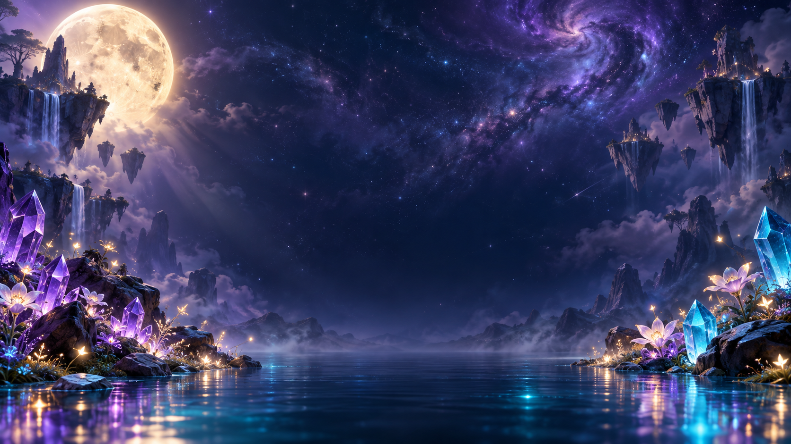

# LUMINA — Bloom of the Cosmos

[Play the game](https://lumina-cosmic-garden.vercel.app/) · [View original submission](https://lumina-cosmic-garden.vercel.app/)

No verified source repository.

| Overall rating | Screenshot score |
| :---: | :---: |
| **54/100** | **Not scored** |

Read the scoring rationale

### Overall rating

Compared against catalog calibration: moorestech 64 is the top, LUMENRIFT 58/68 is the polished browser-game ceiling, Infinite Craft 52/32 is the casual browser-puzzle scale reference, and 2048 38/45 is the minimal puzzle-loop baseline. LUMINA sits above 2048 and near Infinite Craft/LUMENRIFT on scope: a complete 12-level match-3 loop (cascades, ray/bomb/prism specials, frost, Supernova meter, stars, saves, help/levels/settings modals, responsive layout) verified in static page source. It lacks a verified source repository and live play/performance/balance evidence, and no gameplay still could be captured since the board is canvas-rendered, so it stays below the catalog top and below LUMENRIFT at 54.

### Screenshot score

No inspectable gameplay screenshot.

## At a glance

| Detail | Value |
| --- | --- |
| Added to catalog | 29 Sep 2026 · 03:30 UTC |
| Last updated | 29 Sep 2026 · 03:30 UTC |
| Documented creation models | Not established |

## Screenshots

Inspected via webfetch: wide cosmic scenery backdrop, not the match-3 board. Giant moon, purple nebula sky, floating rock islands with waterfalls, glowing purple and blue crystals, flowers, and a reflective lake. Used as the page background behind the game UI; discounted for gameplay graphics scoring.

[Original screenshot](https://lumina-cosmic-garden.vercel.app/cosmos.png)

## Play

- Open the playable build and pick a level from the 12-level Constellation I journey (starts on Moonlit Garden).
- Swap two orthogonally adjacent crystals on the 8 by 8 board: tap two neighbours, swipe, or use arrow keys plus Enter.
- Match 3 or more of a kind to score, cascade, collect goals, and clear frost before moves run out.
- Build Supernova energy with matches and fire it for a board-wide burst; use Hint and Restart as needed.

## Mechanics

- 8 by 8 swap-adjacent match-3 board with legal-move detection and auto reshuffle
- Cascading clears with chained scoring and Supernova energy charging
- 4-in-a-row ray pieces, T or L bomb pieces, and 5-in-a-row rainbow prism pieces
- Frost-tile clearing objectives layered over score and color-collection goals
- 12-level campaign with per-level move counts, score targets, collect quotas, and frost counts
- 3-star score thresholds, personal-best tracking, Hint, Restart, pause, sound, and graphics-quality settings

## Tags

- match-3
- puzzle
- casual
- single-player
- browser
- cosmic
- crystals

## Controls

- Mobile controls: Supported
- Motion controls: Not established
- Gamepad: Not established
- Keyboard/mouse: Supported

## Player modes

- Human players: 1
- Modes: single-player

## Technologies

- **JavaScript** — language ([evidence](https://lumina-cosmic-garden.vercel.app/))
- **Three.js** — rendering ([evidence](https://lumina-cosmic-garden.vercel.app/))
- **WebGL** — rendering ([evidence](https://lumina-cosmic-garden.vercel.app/))
- **Web Audio API** — audio ([evidence](https://lumina-cosmic-garden.vercel.app/))

## Reconstructed prompt

Build LUMINA Bloom of the Cosmos: a polished single-page cosmic match-3 with an 8x8 board, tap/swipe plus keyboard play, cascades, 4-match rays, T/L bombs, 5-match prisms, frost tiles, score plus collection goals, 12 levels, Supernova meter, stars, personal bests, hint/restart/pause/sound/quality settings, and a moonlit cosmic-garden backdrop.

## Source evidence

- X post describes LUMINA as a fully playable cosmic match-3 with cascades, power-ups, levels, and sound, linking the Vercel build. ([source](https://x.com/ToolBraidComp/status/2096348348773028115))
- Playable page title and meta describe an original crystals/cascades/constellations game with Supernova; page renders a level journey (Moonlit Garden, 01/12), goals, LIGHT score, star progress, 24 moves, board, hint/supernova/restart tools, and power legend. ([source](https://lumina-cosmic-garden.vercel.app/))
- Embedded game config defines 12 levels with names, move counts, score targets, color-collect quotas, and frost counts; board logic implements 8x8 match detection, row/col/bomb/prism specials, cascades, scoring, energy, frost, win/lose, shuffle, and save snapshot/restore with validation. ([source](https://lumina-cosmic-garden.vercel.app/))
- Board accessibility label states tap two neighbouring crystals or swipe, and keyboard play with arrow keys plus Enter; board CSS uses touch-action:none and the layout has explicit mobile breakpoints. ([source](https://lumina-cosmic-garden.vercel.app/))
- Page source carries a Three.js Authors MIT license banner and the bundle references WebGL, canvas, AudioContext (Web Audio), and localStorage. ([source](https://lumina-cosmic-garden.vercel.app/))
- cosmos.png inspected as the full-page scenery background (moon, nebula, floating islands, crystals); it is backdrop art, not a capture of the match-3 board, and no static gameplay screenshot asset was found. ([source](https://lumina-cosmic-garden.vercel.app/cosmos.png))
- gh api repository/code search for lumina-cosmic-garden could not run in this environment (gh CLI reports GH\_TOKEN is required), and web search surfaced no verified related GitHub source URL; repository\_url is therefore left null rather than invented. ([source](https://x.com/ToolBraidComp/status/2096348348773028115))

## Fictional reviews

Treat these as illustrative, not real user reviews.

- 85/100: A cozy little cosmos in a browser tab. The cascades keep chaining, the Supernova payoff feels great, and Moonlit Garden eased me in perfectly.
- 62/100: Solid match-3 fundamentals and a gorgeous backdrop, though I wanted more level variety and a sterner challenge curve.
- 95/100: Twelve constellations of pure sparkle. Prism combos, frost puzzles, star chases — I lost an evening to this garden of light.

## Links

- [Original submission](https://lumina-cosmic-garden.vercel.app/)
- [Original submission](https://x.com/ToolBraidComp/status/2096348348773028115)
- [Background artwork inspected](https://lumina-cosmic-garden.vercel.app/cosmos.png)
