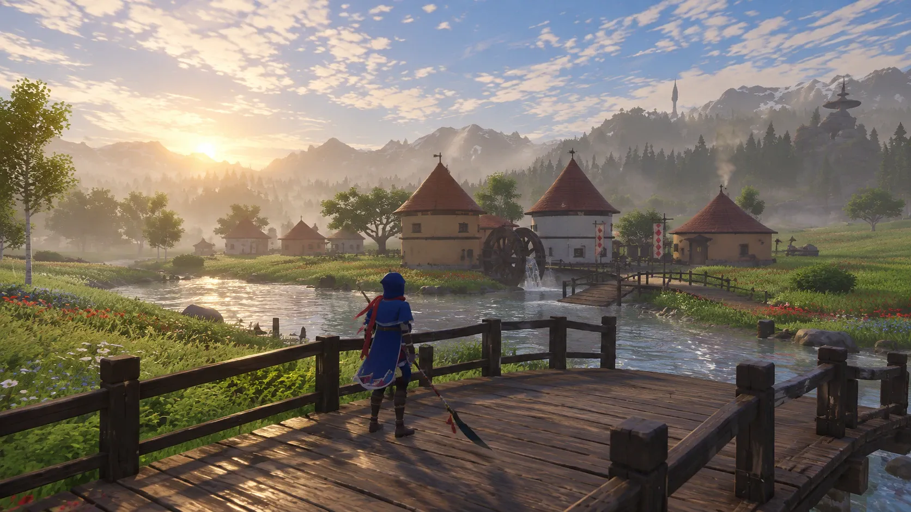
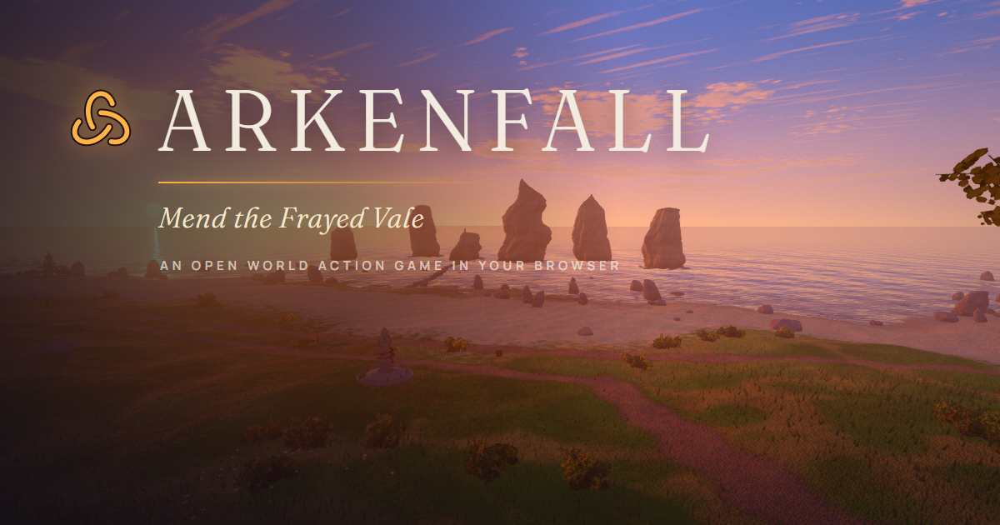

# Arkenfall

[Play the game](https://www.arkenfall.site/) · [View original submission](https://www.arkenfall.site/)

No verified source repository.

| Overall rating | Screenshot score |
| :---: | :---: |
| **58/100** | **78/100** |

Read the scoring rationale

### Overall rating

Excluding itself, most relevant comparators are moorestech (64, verified dense factory systems plus co-op/mods/years of iteration), Meridian Wake (60, playable build with full HUDs and documented 694-system/351-hull scope), Emberwake (53, complete but single 5-minute survivors loop), DRIFTWING (52, polished flight loop) and Kart Royale (50, complete single-track 3D racer). Arkenfall outranks Emberwake, DRIFTWING and Kart Royale on apparent scope (open world, waystones, four-plus enemy archetypes with distinct counters, spindle system, landmark navigation) and on raw visual polish, but sits below Meridian Wake and moorestech because its actual playability, HUD, controls, audio, performance, and systems depth are unverified: the page failed to boot in inspection, no repository or tech manifest exists, and loading art has no UI. Far below AAA on verified content, cinematics, multiplayer/live-ops, and proven performance/balance.

### Screenshot score

Two inspected scene frames show coherent stylized-realist 3D with sunset lighting, dense flowers/grass/trees, detailed village/watermill/bridge architecture, reflective water, and layered mountain/spire depth, exceeding catalog mid-tier 70s (Emberwake, Kart Royale, Turbo Kart Rally, Neural Sight) and edging moorestech 76 on raw scene polish and composition. Capped at 78 because frames are curated loading art with no HUD, enemies, or combat UI and runtime output is unverified, and the banner is non-gameplay promo. Stills prove nothing about motion, performance, or balance.

## At a glance

| Detail | Value |
| --- | --- |
| Added to catalog | 29 Sep 2026 · 03:29 UTC |
| Last updated | 29 Sep 2026 · 03:29 UTC |
| Documented creation models | Not established |

## Screenshots

Inspected: third-person hero in blue cloak with red scarf sprinting through dense flower meadow holding a long bladed polearm, roundhouse village with watermill and bridge over a river ahead, Loomspire-like tower and snowy mountains behind, warm sunset light and detailed foliage. No HUD visible; appears to be curated in-engine/key art rather than verified runtime capture.

[Original screenshot](https://www.arkenfall.site/loading/art-03.webp)

Inspected: same blue-cloaked hero standing on a wooden bridge overlooking a river toward watermill houses with red conical roofs, banners, sun glitter on water, misty forest and snowy peaks with distant spire. Rich daylight, detailed wood, water, and vegetation; no HUD or enemies visible, curated loading art.

[Original screenshot](https://www.arkenfall.site/loading/art-04.webp)

Inspected: promotional banner with ARKENFALL title, tagline 'Mend the Frayed Vale' and 'AN OPEN WORLD ACTION GAME IN YOUR BROWSER' over a sunset coastal scene with sea stacks, beach path, grass and shrubs. Title/marketing card, not active gameplay; discounted for graphics scoring, put last.

[Original screenshot](https://www.arkenfall.site/og.png)

## Play

- Open https://www.arkenfall.site/ in a desktop browser and wait for the engine to load past the ARKENFALL progress line
- If 'Arkenfall could not start' appears, use Reload; playability could not be verified from the failed headless load
- Rethread waystones to fast-travel back along their thread
- Dodge at the last instant to slow time; parry just before a blow lands then strike while enemies reel
- Use heavy cleave to pull aside Knotguard shields; circle Loomhulks to hit the back ember knot
- Strike Emberpods and lure the Unravelled into the flames; use the Lash to drag Shuttlewings down
- Spend spindle charge when full to unravel nearby enemies; use the Loomspire as north

## Mechanics

- Third-person open-world exploration of the Frayed Vale with Loomspire north landmark
- Last-instant dodge triggering slow-motion and parry-then-punish windows
- Knotguard woven shields countered by heavy cleave
- Spindle charged by blows, unleashing area unravel when full
- Waystone rethread fast travel
- Explosive Emberpods usable as traps against the Unravelled
- Loomhulk back weak-point requiring circling
- Lash tool to ground hovering Shuttlewings
- Unravelled enemy faction and Mend-the-Vale objective with Loomspire climb

## Tags

- open-world
- action
- third-person
- fantasy
- souls-like
- browser
- 3d
- single-player

## Controls

- Mobile controls: Not established
- Motion controls: Not established
- Gamepad: Not established
- Keyboard/mouse: Not established

## Player modes

- Human players: 1
- Modes: single-player

## Reconstructed prompt

Build a browser open-world third-person action game called Arkenfall: a grassy vale with a village, river, and distant Loomspire landmark, a cloaked hero with dodge slow-motion, parry-punish, heavy cleave vs shields, a chargeable spindle AoE, waystone fast travel, and enemies including shield Knotguards, Emberpods, back-weak-point Loomhulks and hovering Shuttlewings dragged down by a Lash, with sunset key art loading tips and a fullscreen canvas client at arkenfall.site.

## Source evidence

- Page title and meta describe Arkenfall as 'an open world action game that runs in your browser' with the goal 'Mend the Frayed Vale, fight the Unravelled and climb the Loomspire' ([source](https://www.arkenfall.site/))
- Loading screen lists 10 gameplay tips: waystone fast travel, last-instant dodge slows time, Knotguard shields broken by heavy cleave, spindle charged by blows with AoE unravel, exploding Emberpods, Loomhulk ember knot on back, parry-then-punish, Lash dragging down hovering Shuttlewings, plus Loomspire-north and Kettle Ford landmarks ([source](https://www.arkenfall.site/))
- Page shell is a playable client, not just promo: fixed #app with full-viewport canvas styling, #ui-root overlay, module script ./assets/index-wnjCTfhW.js, fullscreen landscape PWA manifest, and a 20-second boot-failure state reading 'Arkenfall could not start. Something went wrong while starting.' ([source](https://www.arkenfall.site/))
- No explicit keyboard, mouse, touch-joystick, gamepad, or motion bindings are documented on the inspected page; viewport/meta fullscreen tags alone are responsive layout, not proof of touch controls, so all control statuses remain unknown ([source](https://www.arkenfall.site/))
- Two inspected loading images each show a single blue-cloaked protagonist with a bladed polearm in a third-person open landscape and no multiplayer lobby, co-op HUD, or second avatar, supporting single-player; no explicit multiplayer or player-count statement was found ([source](https://www.arkenfall.site/loading/art-03.webp))
- GitHub search returns unbridledpc/arkenengine ('Arkenfall Project'), but its inspected README is a typed-asyncio Open Tibia 8.60 server engine with 20 Hz tick, XTEA frames, and OTClient login, with no reference to Frayed Vale, Loomspire, Unravelled, or arkenfall.site, so it is not the same game and no verified repository exists ([source](https://github.com/unbridledpc/arkenengine))
- gh api via gh CLI was unavailable (no GH\_TOKEN in runner) and unauthenticated api.github.com core was rate-limited (remaining 0); repository verification used unauthenticated search plus page fetches instead ([source](https://api.github.com/rate_limit))
- Local catalog at games listing holds 66 entries topped by moorestech overall 64/screenshots 76 and Meridian Wake overall 60/screenshots 68; no Arkenfall entry or matching playable/repository URL was found, so catalog\_slug is null ([source](https://github.com/SubmitGame/.github))
- No engine, language, or version manifest is documented on the inspected page; only a generic module script and canvas shell were observed, so no technology entry is established rather than inferring from appearance ([source](https://www.arkenfall.site/))
- No creation-model attribution appears in inspected page sources; third-party awesome-list/X/LinkedIn claims about Claude Opus 5.5 are not project-source attribution, so creation\_models is empty ([source](https://www.arkenfall.site/))

## Fictional reviews

Treat these as illustrative, not real user reviews.

- 85/100: The Vale is stunning in a browser tab and the counters click: I baited Emberpods, circled a Loomhulk, and parried a Knotguard into a full-spindle unravel. Best-looking open combat in this batch.
- 60/100: Ambitious dodge-parry-cleave loop with clever enemy weak points, but I could not verify a full run from the loading art and the boot failed on my first visit. Show me a stable build with HUD and boss footage.
- 100/100: I rethreaded back to Kettle Ford at sunset with the Loomspire on the horizon and everything just sang. This is the browser open-world game I have been waiting for.

## Links

- [Original submission](https://www.arkenfall.site/)
