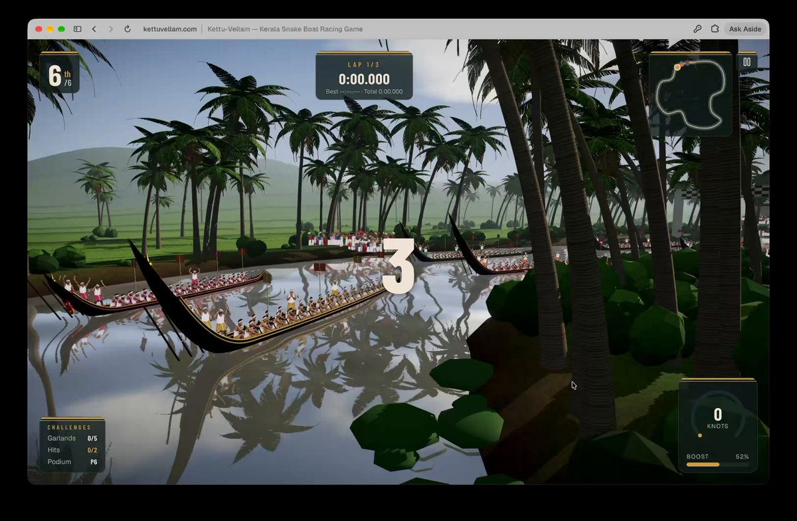

# Kettu-Vellam — Kerala Snake Boat Racing Game

[Play the game](https://www.kettuvellam.com/) · [View original submission](https://x.com/jessinvibe/status/2103565292198838314)

No verified source repository.

| Overall rating | Screenshot score |
| :---: | :---: |
| **56/100** | **67/100** |

Read the scoring rationale

### Overall rating

Available evidence shows a complete 3-lap, 6-boat, 3-course 3D browser racer with position/lap/minimap/speed/boost/garland HUD, rival crews, leaderboards and crowd/vanchipattu atmosphere. Against the catalog it sits above single-circuit Kart Royale (50) and Turbo Kart Rally (40) on course count and HUD completeness, near Sakura Rally (56), Radikal Riders (54) and DRIFTWING (52) on stylized-3D racing scope, and below Meridian Wake (60), LUMENRIFT (58) and moorestech (64) which show deeper systems, denser UI or verified technical depth. Evidence gaps: no public source, gh api unavailable in this environment so no repository verification, controls undocumented, audio/leaderboard liveness/performance/balance unverified from stills and metadata alone. Stills and docs do not prove playability or performance.

### Screenshot score

The inspected in-engine frame is the game's own runtime output: low-poly canal circuit with palm canopy, water reflections, three chundan vallams with rower crews, bank crowds, and a full HUD (6th/6, LAP 1/3 timer, minimap, knots, boost 52%, garlands/hits/podium challenges, countdown 3). Coherent stylized composition sits near Sakura Rally (68) and OUT OF THE BOX (68) on scene richness, below Kart Royale/Turbo Kart Rally (70), Emberwake (70) and DRIFTWING (72) on lighting crispness and detail density, above OSRS Tower Defense (65) on 3D depth, and well above flat DOM games (2048 45, Blackjack 35, neverquest 30). The photorealistic sunset og-image is curated promotional reference, not gameplay, and is discounted. Stills prove nothing about motion, performance, or feel.

## At a glance

| Detail | Value |
| --- | --- |
| Added to catalog | 29 Sep 2026 · 03:30 UTC |
| Last updated | 29 Sep 2026 · 03:30 UTC |
| Documented creation models | Not established |

## Screenshots

Inspected 1200x784 browser capture at kettuvellam.com: low-poly backwater canal with palm trees and water reflections, three long black chundan vallams with seated rower crews mid-race, bank crowds, countdown '3', HUD with 6th/6, LAP 1/3 timer, minimap, 0 KNOTS, BOOST 52%, and CHALLENGES Garlands 0/5, Hits 0/2, Podium P6. The game's own runtime output.

[Original screenshot](https://pbs.twimg.com/amplify_video_thumb/2103564475345534976/img/QsG6n8fOagcTHwu2?format=jpg&name=medium)

Inspected 1200x630 image: photorealistic golden-hour snake boat packed with rowers, splashing water, palm banks and crowds. Curated promotional/reference art matching the site og:image alt text, not in-engine gameplay; discounted for graphics scoring.

[Original screenshot](https://www.kettuvellam.com/og-image.jpg)

## Play

- Open https://www.kettuvellam.com/ in a web browser and wait past the 'Launching onto the backwaters' loader
- Pick a course: Punnamada Lake, the Kuttanad canals, or the Vembanad monsoon storm
- Start 3-lap race from 6th of 6 against five rival crews
- Race the circuit, follow the minimap, collect garlands and manage boost shown in knots
- Finish on the podium and chase best-lap times on the live leaderboards

## Mechanics

- 6-boat snake-boat (chundan vallam) fleet racing over 3 laps
- Three courses: Punnamada Lake, Kuttanad canals, Vembanad monsoon storm
- Position tracking (6th/6) with lap timer and best/total times
- Speed in knots with boost meter
- Collectible garlands challenge (0/5) and hits challenge (0/2)
- Minimap circuit guide and podium result
- Live leaderboards and best-lap chase
- Rival AI crews with crowd atmosphere

## Tags

- racing
- sports
- boat-racing
- 3d
- browser
- single-player
- time-attack
- kerala

## Controls

- Mobile controls: Not established
- Motion controls: Not established
- Gamepad: Not established
- Keyboard/mouse: Not established

## Player modes

- Human players: 1
- Modes: single-player

## Technologies

- **Next.js** — framework ([evidence](https://www.kettuvellam.com/))
- **Vercel** — build ([evidence](https://www.kettuvellam.com/))
- **v0.app** — build ([evidence](https://www.kettuvellam.com/))

## Reconstructed prompt

Build a free 3D browser Kerala snake boat racing game called Kettu-Vellam: chundan vallam fleet racing for 3 laps against 5 AI crews across Punnamada Lake, narrow Kuttanad canals, and a Vembanad monsoon storm, with lap/best-lap timers, position, minimap, knots speedometer, boost, garland and hits challenges, podium results, live leaderboards, crowd atmosphere and vanchipattu rhythm, as a fullscreen landscape Next.js/Vercel web app.

## Source evidence

- X post by @jessinvibe describes a Kerala Snake Boat Race Game built with v0, raced through Punnamada, Kuttanad canals and a Vembanad monsoon storm, free to play at kettuvellam.com with best-lap challenge; attached video shows in-browser gameplay ([source](https://x.com/jessinvibe/status/2103565292198838314))
- kettuvellam.com title and meta description: Kettu-Vellam Kerala Snake Boat Racing Game; race chundan vallam boats through Punnamada Lake, Kuttanad canals and Vembanad monsoon storm; free 3D browser game with rival crews, live leaderboards, crowd atmosphere and vanchipattu ([source](https://www.kettuvellam.com/))
- Embedded JSON-LD VideoGame schema: name Kettu-Vellam, genre Racing/Sports, platform Web browser, playMode SinglePlayer, price 0 ([source](https://www.kettuvellam.com/))
- Site meta generator is v0.app; page loads Next.js \_next/static chunks and a GameLoader with 'Launching onto the backwaters' splash; response server is Vercel with canonical https://kettuvellam.com and manifest fullscreen landscape ([source](https://www.kettuvellam.com/))
- Manifest: name Kettu-Vellam, display fullscreen, orientation landscape, categories games/sports/entertainment ([source](https://www.kettuvellam.com/manifest.webmanifest))
- og:image shows photorealistic snake-boat sunset scene; video thumbnail shows actual low-poly 3D gameplay HUD (LAP 1/3, 6th/6, minimap, knots, boost, garlands/hits/podium). No public source repository linked from the post or site; gh api could not be used in this environment (no token), so no GitHub source established ([source](https://x.com/jessinvibe/status/2103565292198838314))

## Fictional reviews

Treat these as illustrative, not real user reviews.

- 85/100: Fictional review: threading the Kuttanad canals six-wide with the drum beat rising is pure festival chaos — my best lap finally cracked the leaderboard.
- 62/100: Fictional review: charming low-poly backwaters and a real three-track structure, but the storm leg gets samey and I wanted clearer steering feedback.
- 100/100: Fictional review: the monsoon final at dusk with all six vallams sprinting had me shouting vanchipattu at my screen — an instant Onam classic.

## Links

- [Original submission](https://x.com/jessinvibe/status/2103565292198838314)
- [Play the game](https://www.kettuvellam.com/)
