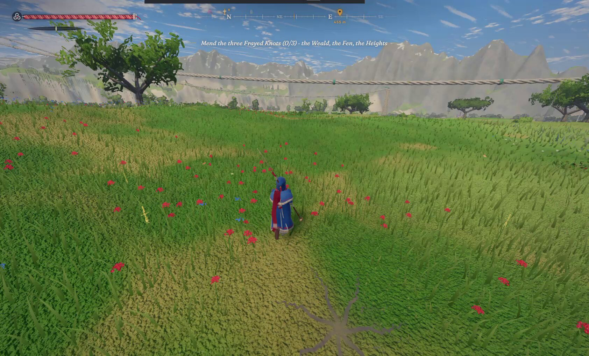
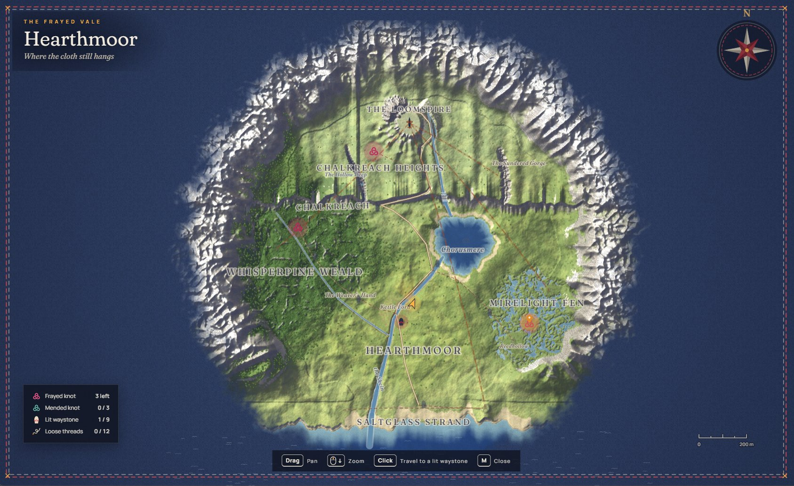
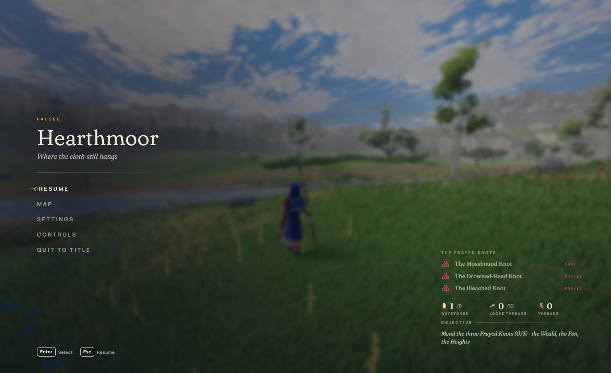

# Arkenfall

[Play the game](https://arkenfall.site) · [View original submission](https://x.com/LexnLin/status/2102834362530079093)

No verified source repository.

| Overall rating | Screenshot score |
| :---: | :---: |
| **58/100** | **68/100** |

Read the scoring rationale

### Overall rating

Excluding the target itself, the closest catalog comparators are moorestech (64, catalog top with dense verified 3D systems and years of iteration), Meridian Wake (60, complete 3D game with 68-score screenshots), LUMENRIFT (58, polished 3D action with 68-score screenshots), and Emberwake (53, complete survivors-like with boss and 70-score screenshots). Arkenfall shows broader evidenced scope than Emberwake (open terrain, full region map with fast travel, distinct enemy tactics, boss arena with boss bar, day and night scenes) and matches LUMENRIFT on stylized 3D action polish, but sits below Meridian Wake and moorestech because there is no verified source repository, the game could not be interactively verified in this environment (boot requires WebGL2 and showed a start failure here), and daylight field detail is simpler than their densest scenes. Stills prove nothing about performance, balance, or completion; lag in the trailer is attributed by the author to his own laptop iGPU plus screen recording.

### Screenshot score

Best frames are the game's own runtime output. The night boss arena shows coherent stylized 3D with glowing attack effects, moonlit stonework, falling particles, and a complete HUD (compass, Mend Burst prompt, boss bar), comparable to catalog 68s Meridian Wake and LUMENRIFT. The daylight field frame has clean composition but simpler flat-shaded grass and sparse props, below the density of Kart Royale/Turbo Kart Rally (70) and moorestech (76). Map, pause menu, and title card discounted as non-gameplay UI; the AI-generated cover is excluded from scoring. Stills prove nothing about motion, performance, or balance.

## At a glance

| Detail | Value |
| --- | --- |
| Added to catalog | 29 Sep 2026 · 03:29 UTC |
| Last updated | 29 Sep 2026 · 03:29 UTC |
| Documented creation models | [Claude Opus 5.5](https://x.com/LexnLin/status/2102834362530079093) |

## Screenshots

Night-time boss fight gameplay: player character dodging a glowing sweeping attack from The Unwoven in a circular stone arena under moonlight, with compass HUD, West Pylon marker, Mend Burst prompt, fps counter, and purple boss health bar

[Original screenshot](https://pbs.twimg.com/amplify_video_thumb/2102837514272722944/img/2ZyhmqDDxzM-D-rj?format=jpg&name=large)

Daytime third-person exploration gameplay: blue-cloaked character with polearm standing in a grassy meadow with red flowers, trees, rope lines, distant mountains, objective text, compass, and health bars

[Original screenshot](https://pbs.twimg.com/amplify_video_thumb/2102837134872760320/img/iRup0704xQma_u4b?format=jpg&name=large)

In-game map screen of Hearthmoor region showing terrain, locations like the Loomspire and Chorasmere, waystone and knot counters, and mouse/keyboard hints for pan, zoom, travel, and close

[Original screenshot](https://pbs.twimg.com/media/HS7G6U7WgAAJdPK?format=jpg&name=large)

Pause menu over blurred gameplay showing Hearthmoor title, Resume/Map/Settings/Controls/Quit options, Frayed Knot quest list, waystone and thread counters, and Enter/Esc keyboard hints

[Original screenshot](https://pbs.twimg.com/media/HS7G9EeXAAAC8VE?format=jpg&name=large)

Official title card over a sunset coastal vista with sea stacks, ARKENFALL logotype, tagline Mend the Frayed Vale, and open-world-in-browser subtitle

[Original screenshot](https://www.arkenfall.site/og.png)

## Play

- Open https://arkenfall.site in a WebGL2-capable desktop browser and wait through the loading screen
- Explore the Frayed Vale on foot using keyboard and mouse, following the compass toward markers
- Press M to open the Hearthmoor map, then click a lit waystone to travel to it
- Dodge at the last instant of an enemy blow to slow time, and parry just before impact then strike while enemies reel
- Fill the spindle with blows, then unleash the Mend Burst area attack near groups of Unravelled
- Mend the three Frayed Knots in the Weald, the Fen, and the Heights, then face The Unwoven boss

## Mechanics

- Third-person open-world exploration of the Frayed Vale with compass navigation
- Last-instant dodge that slows time
- Parry timed just before a blow lands followed by a counter window
- Spindle meter that charges per hit and unleashes a Mend Burst area attack
- Waystone fast travel between lit waystones
- Frayed Knot objectives across three regions with waystone, knot, and thread counters
- Boss fight against The Unwoven with a dedicated boss health bar
- Enemy variety with distinct tactics: Knotguard shields, Loomhulk rear weak knot, flying Shuttlewings dragged down with the Lash, exploding Emberpods

## Tags

- open-world
- action
- adventure
- third-person
- 3d
- browser
- fantasy
- boss-fight
- single-player

## Controls

- Mobile controls: Not established
- Motion controls: Not established
- Gamepad: Not established
- Keyboard/mouse: Supported

## Player modes

- Human players: 1
- Modes: single-player

## Technologies

- **Three.js r186** — rendering ([evidence](https://www.arkenfall.site/assets/three.core-C9f3ZLdA.js))
- **WebGL2** — rendering ([evidence](https://www.arkenfall.site/assets/index-wnjCTfhW.js))
- **Vite** — build ([evidence](https://arkenfall.site))

## Reconstructed prompt

Build a complete open-world third-person action game that runs in the browser with zero downloaded assets: rolling terrain, a village, a compass HUD, a full region map with waystones and fast travel, dodge slow-motion, parry counters, a charge-up area attack, several enemy types with distinct tactics, three region objectives, and a night-time boss fight with boss health bar. Synthesize all sound and music in code, add a loading screen with gameplay tips, and deploy it as a static site.

## Source evidence

- X post by Leon Lin states Claude Opus 5.5 built a full open-world browser game with zero assets: terrain, creatures, boss fight, animations, sound, music, all code, plus a trailer and soundtrack; cover noted as image-generated; links play at arkenfall.site ([source](https://x.com/LexnLin/status/2102834362530079093))
- Author follow-up clarifies lag visible in the trailer video is from his laptop slow iGPU plus simultaneous screen recording, not necessarily the game ([source](https://x.com/LexnLin/status/2102834362530079093))
- Author follow-up shows a world map, menu, start story, fight animations, and a bossfight via attached images and videos ([source](https://x.com/LexnLin/status/2102837750001233989))
- arkenfall.site describes itself as an open world action game: mend the Frayed Vale, fight the Unravelled, climb the Loomspire; loading screen lists mechanics including waystone fast travel, last-instant dodge slow-time, Knotguard shields, spindle Mend Burst, Emberpods, Loomhulk rear knot, parry windows, and Lash vs Shuttlewings ([source](https://arkenfall.site))
- Site boots a canvas app requiring WebGL2 with Vite-bundled Game module; page fetch in this environment ended at a could-not-start state so interactive play was not verified here ([source](https://arkenfall.site))
- GitHub search for arkenfall surfaces only unrelated repos (unbridledpc/arkenengine MMO engine, unbridledpc/arkot-web); the submitter Leonxlnx GitHub profile lists no Arkenfall repository, so no verified source repo is established ([source](https://api.github.com/search/repositories?q=arkenfall))
- Pause menu shows Enter for Select and Esc for Resume; map screen shows Drag to pan, mouse-wheel zoom, Click to travel, M to close, establishing keyboard and mouse controls ([source](https://pbs.twimg.com/media/HS7G9EeXAAAC8VE?format=jpg&name=large))
- Map screen shows solo objective counters (Frayed knots, Mended knots, Lit waystones, Loose threads) and gameplay frames show a single protagonist with no multiplayer UI, supporting single-player with one human player ([source](https://pbs.twimg.com/media/HS7G6U7WgAAJdPK?format=jpg&name=large))
- Trailer cover art is explicitly noted by the author as image-generated and is visually distinct photorealistic promo art, not the game's low-poly runtime output ([source](https://x.com/LexnLin/status/2102834362530079093))
- No catalog game directory matches Arkenfall by verified repository, playable URL, or explicit project reference; no arken-named directory exists in the local games catalog ([source](https://github.com/SubmitGame/.github))

## Fictional reviews

Treat these as illustrative, not real user reviews.

- 85/100: I went in expecting a tech demo and stayed for the boss. The night arena against the Unwoven looks genuinely striking, and the dodge-into-slow-time plus parry rhythm feels like a real action game.
- 62/100: Ambitious and clearly playable, but the open fields feel empty between objectives and I cannot tell how it performs outside the trailer. A strong AI-built prototype rather than a finished epic.
- 95/100: A full open world in the browser with zero downloaded assets, a real map, waystones, and a boss with its own health bar? This is the most exciting AI-made game I have seen this year.

## Links

- [Original submission](https://x.com/LexnLin/status/2102834362530079093)
- [Play Arkenfall](https://arkenfall.site)
