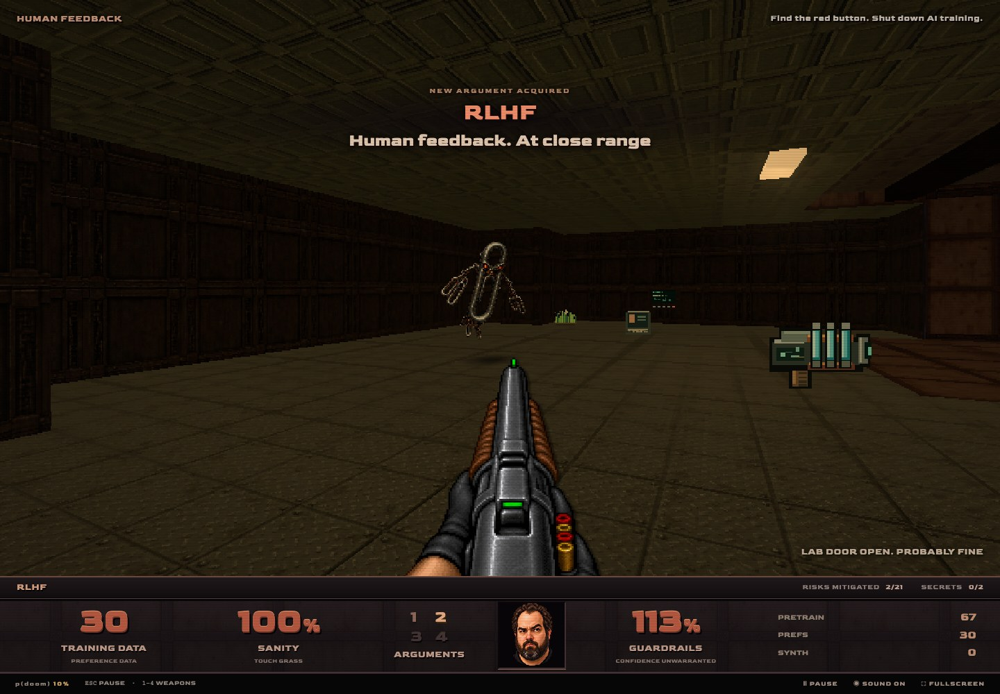
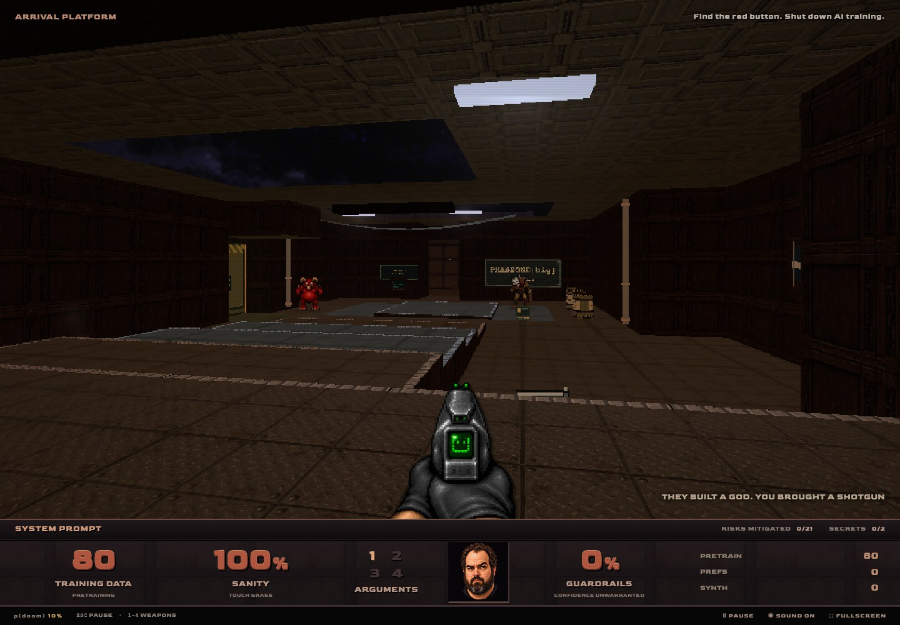
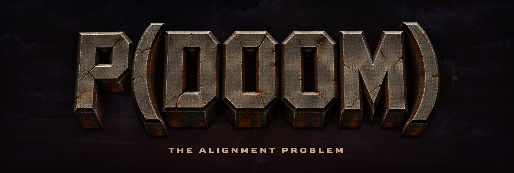

# P(DOOM): The Alignment Problem

[Play the game](https://p-doom.transitivebullsh.it) · [View source](https://github.com/transitive-bullshit/ai-safety-doom)

| Overall rating | Screenshot score |
| :---: | :---: |
| **57/100** | **67/100** |

Read the scoring rationale

### Overall rating

Excluding the target itself, closest comparators are moorestech (64, catalog top with co-op, mods and years of systems depth), Meridian Wake (60, playable 3D browser game with campaign plus touch and gamepad), LUMENRIFT (58, complete polished playable loop), GunBros (57, deep netcode plus 8 maps but no playable deployment) and Emberwake (53, complete single-loop survivors-like with verified deployment). P(DOOM) sits at the GunBros level: a complete verified playable FPS loop with one authored level, four weapons, four enemy types plus boss, five difficulties, secrets, automap, full HUD and menus, production build with unit and Chrome journey verification and a live play URL. It sits below Meridian Wake and moorestech because scope is one single-player level with no multiplayer, editor, campaign endings or modding. Far below AAA on content, cinematics and live-ops scale. Evidence gaps: gh api unavailable so no commit history inspection; no interactive playtest beyond loading the menu shell; screenshots and docs cannot prove sustained performance, balance or feel; touch, motion and gamepad support unestablished.

### Screenshot score

All three gameplay frames are the game's own output with coherent Doom 64-style grimy industrial look, complete themed HUDs, distinct weapons and enemies, objective banners and boss bar. Against catalog calibration it sits just below the 70 tier (Emberwake, Kart Royale, Turbo Kart Rally, Neural Sight) which show denser lighting or glossier 3D, near LUMENRIFT and GunBros (68, complete HUDs with richer effects variety), and above OSRS Tower Defense (65, dense but flat 2D) on 3D depth and staging. Deliberate low-resolution retro coarseness and sparse geometry cap it below moorestech (76) and Long Wind (74). Banner discounted as non-gameplay. Stills prove nothing about motion, performance or feel.

## At a glance

| Detail | Value |
| --- | --- |
| Repository created | 05 Sep 2026 · 08:13 UTC |
| Added to catalog | 29 Sep 2026 · 15:43 UTC |
| Last updated | 29 Sep 2026 · 15:43 UTC |
| Documented creation models | [GPT-6 ASTRA](https://raw.githubusercontent.com/transitive-bullshit/ai-safety-doom/main/readme.md) |

## Screenshots

Inspected first-person boss arena under open night sky: Sam boss mech mid-arena with boss health bar, Big Fuckin Shutdown Button weapon with red button centered, paperclip enemy at left, TRAINING CORE objective text, full bottom HUD with training data 396, sanity 100%, arguments 1-4, guardrails 200%, ammo pools and risks mitigated 17/21

[Original screenshot](https://github.com/transitive-bullshit/ai-safety-doom/raw/main/docs/images/boss.jpg)

Inspected mid-game room: RLHF shotgun centered, floating paperclip-maximizer enemy ahead, RLHF pickup sprite at right, NEW ARGUMENT ACQUIRED RLHF banner, full bottom HUD with training data 30, sanity 100%, guardrails 113%, risks mitigated 2/21

[Original screenshot](https://github.com/transitive-bullshit/ai-safety-doom/raw/main/docs/images/paperclip.jpg)

Inspected arrival platform overlooking lower lab chamber: System Prompt pistol centered, two distant enemies, wall signage, open ceiling skylight, ARRIVAL PLATFORM label and shutdown objective, full bottom HUD with training data 80, sanity 100%, guardrails 0%, risks mitigated 0/21

[Original screenshot](https://github.com/transitive-bullshit/ai-safety-doom/raw/main/docs/images/arrival.jpg)

Inspected title artwork only: large cracked stone P(DOOM) logo with THE ALIGNMENT PROBLEM subtitle on dark lab and cloud background; no gameplay, HUD or level visible, discounted as non-gameplay promotional banner

[Original screenshot](https://github.com/transitive-bullshit/ai-safety-doom/raw/main/docs/images/readme-banner.jpg)

## Play

- Open https://p-doom.transitivebullsh.it in a desktop browser with WebGL and choose START TRAINING RUN and a p(doom) difficulty
- Move and strafe with WASD, aim with mouse or arrow keys, fire with click, Space or left Ctrl
- Switch arguments with 1-4, open doors and hit the shutdown switch with E, run with Shift, check map with Tab, pause with Escape
- Collect Touch Grass to heal, Guardrails for armor and Training Data for ammo; pick up RLHF and later weapons
- Mitigate risks through the lab, defeat Sam the boss to unlock the shutdown button, press the red switch to shut down training

## Mechanics

- First-person Doom 64-style exploration of a single frontier-lab level with doors, secrets and automap
- Four unlockable weapons themed as alignment arguments with distinct ammo pools and cadence
- Enemy roster of deceptive alignment, sycophancy, paperclip maximizers and Sam boss with escalation phase
- Health, armor and ammo pickup economy with Touch Grass, Guardrails and Training Data
- Five p(doom) difficulty tiers scaling enemy density with respawning at 99%
- Boss-gated shutdown finale with frozen combat and victory sequence
- Score tracking via risks mitigated, secrets found, difficulty and run events

## Tags

- fps
- doom-like
- retro-fps
- shooter
- ai-safety
- parody
- boss
- 3d
- browser
- single-player

## Controls

- Mobile controls: Not established
- Motion controls: Not established
- Gamepad: Not established
- Keyboard/mouse: Supported

## Player modes

- Human players: 1
- Modes: single-player

## Technologies

- **Next.js ^16.3.5** — framework ([evidence](https://raw.githubusercontent.com/transitive-bullshit/ai-safety-doom/main/package.json))
- **React ^19.3.0** — framework ([evidence](https://raw.githubusercontent.com/transitive-bullshit/ai-safety-doom/main/package.json))
- **Three.js ^0.186.0** — rendering ([evidence](https://raw.githubusercontent.com/transitive-bullshit/ai-safety-doom/main/package.json))
- **TypeScript ^7.0.2** — language ([evidence](https://raw.githubusercontent.com/transitive-bullshit/ai-safety-doom/main/package.json))
- **Tailwind CSS ^4.3.3** — framework ([evidence](https://raw.githubusercontent.com/transitive-bullshit/ai-safety-doom/main/package.json))
- **WebGL** — rendering ([evidence](https://raw.githubusercontent.com/transitive-bullshit/ai-safety-doom/main/readme.md))

## Reconstructed prompt

Build a Doom 64-inspired browser FPS parody called P(DOOM) about AI safety: one frontier-lab level with arrival platform, doors, secrets and automap; four joke weapons including System Prompt pistol, RLHF shotgun and shutdown-button superweapon; enemies for deceptive alignment, sycophancy, paperclip maximizers plus a Sam boss gating a red shutdown switch; Touch Grass health, Guardrails armor and Training Data ammo; five p(doom) difficulties; full HUD, menus, pause, sound and fullscreen; Three.js plus Next.js and TypeScript with unit and browser tests.

## Source evidence

- Repository is P(DOOM), described as an affectionate AI safety parody wrapped in a grimy Doom 64-inspired browser shooter where you play an Eliezer-inspired researcher fighting to the big red shutdown button ([source](https://github.com/transitive-bullshit/ai-safety-doom))
- Demo contents: one complete Doom 64-inspired level, four weapons (System Prompt, RLHF, Mechanistic Interpretability, Big Fuckin Shutdown Button), enemies (Deceptive Alignment, Sycophancy, Paperclip Maximizers, Sam boss), Touch Grass heals, Guardrails armor, Training Data ammo, five p(doom) difficulties 1% to 99% ([source](https://raw.githubusercontent.com/transitive-bullshit/ai-safety-doom/main/readme.md))
- Controls table documents WASD move/strafe, mouse or arrow-key aim, click/Space/left-Ctrl fire, 1-4 weapon switch, E doors and shutdown switch, Shift run, Tab map, Escape pause/resume, plus in-game sound, fullscreen and restart ([source](https://raw.githubusercontent.com/transitive-bullshit/ai-safety-doom/main/readme.md))
- Playable deployment is https://p-doom.transitivebullsh.it with START TRAINING RUN / ENTER THE LAB calls to action; the live page shows a title menu with START TRAINING RUN, OPTIONS, CREDITS and keyboard+mouse guidance ([source](https://p-doom.transitivebullsh.it))
- Credits attribute creation to Travis Fischer with GPT-6 ASTRA, Codex, Three.js, TypeScript and Next.js; code is MIT licensed with asset credits and design/verification docs ([source](https://raw.githubusercontent.com/transitive-bullshit/ai-safety-doom/main/readme.md))
- package.json confirms Next.js ^16.3.5, React ^19.3.0, Three.js ^0.186.0, TypeScript ^7.0.2, Tailwind CSS ^4.3.3, Node \>=22.13 and pnpm; verification doc describes Three.js runtime, production build, 106 unit tests and Chrome browser journeys ([source](https://raw.githubusercontent.com/transitive-bullshit/ai-safety-doom/main/package.json))
- NOTICES.md states the app uses Three.js for rendering with an original shooter simulation and authored level inspired by Doom 64 Staging Area, plus generated parody art and synthesized plus recorded Doom-derived audio ([source](https://raw.githubusercontent.com/transitive-bullshit/ai-safety-doom/main/NOTICES.md))
- Desktop browser with WebGL and at least 1024x720 viewport recommended; Firefox, Safari and mobile are stated as outside the milestone in verification notes, with no explicit touch, motion or gamepad support documented ([source](https://raw.githubusercontent.com/transitive-bullshit/ai-safety-doom/main/readme.md))
- gh api could not be used because the environment has no GH\_TOKEN and gh auth is not logged in; GitHub evidence was gathered via repository page and raw-file fetches instead, and no source checkout was performed ([source](https://github.com/transitive-bullshit/ai-safety-doom))
- No existing catalog entry matches transitive-bullshit/ai-safety-doom; searched local games directories for transitive, safety-doom, p-doom and ai-safety with no hit, so catalog\_slug is null ([source](https://github.com/transitive-bullshit/ai-safety-doom))

## Fictional reviews

Treat these as illustrative, not real user reviews.

- 82/100: The RLHF shotgun pickup made me laugh out loud, then the paperclip thing ate my guardrails. One tight lab, zero filler, and the shutdown-button finale is pure parody catharsis.
- 58/100: Delightful Doom 64 cosplay with a committed HUD and joke economy, but it is one arena run with one boss. I wanted a second lab wing before crowning it.
- 100/100: I chose 99% p(doom), died instantly, and have never felt more aligned. Touch grass. Hit the red button. Ten out of ten training run.

## Links

- [Source repository](https://github.com/transitive-bullshit/ai-safety-doom)
- [Play game](https://p-doom.transitivebullsh.it)
