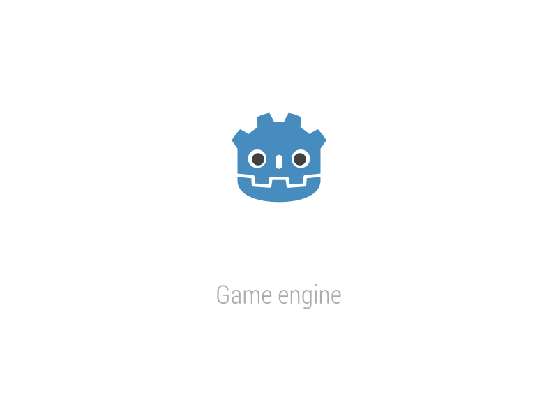

# Plantas vs IA

[Play the game](https://yefry08.github.io/plantas-vs-ia/) · [View source](https://github.com/yefry08/plantas-vs-ia)

| Overall rating | Screenshot score |
| :---: | :---: |
| **50/100** | **Not scored** |

Read the scoring rationale

### Overall rating

Scope on paper (15 plants, 22 robots, 6 ally cards, 4 companions, 24 levels in 5 zones, 3-phase boss with 2 endings, procedural art, code-composed music, autotest harness) is close to fellow tower defense OSRS Tower Defense (overall 52, screenshots 65, with 12 towers, 61 monsters, 130 waves and inspectable gameplay frames) and well above minimal TD Taipo (35, one small map, three towers). But no gameplay screenshot or video could be inspected — the only image served is the default Godot engine splash — so visual polish, readability, performance and balance are unverified. That gap places it below verified-visual catalog entries such as Kart Royale (50, complete 3D loop with polished frames) in confidence and well below top-down scope leaders moorestech (64) and GREYWATCH (62). Score reflects documented design depth discounted for unverified execution; source and stills do not prove playability, performance, or balance.

### Screenshot score

No inspectable gameplay screenshot.

## At a glance

| Detail | Value |
| --- | --- |
| Repository created | 26 Sep 2026 · 02:28 UTC |
| Added to catalog | 06 Oct 2026 · 15:10 UTC |
| Last updated | 06 Oct 2026 · 15:10 UTC |
| Documented creation models | Not established |

## Screenshots

Inspected 800x600 PNG: default Godot engine loading splash (blue robot head icon with GODOT / Game engine text on black). It is the web-export status splash referenced as index.png, not gameplay output; no board, plants, robots, HUD or menus are visible.

[Original screenshot](https://yefry08.github.io/plantas-vs-ia/index.png)

## Play

- Open https://yefry08.github.io/plantas-vs-ia/ in a browser; the page loads a Godot 4 web export (canvas plus index.js, index.pck and index.wasm).
- Pick a plant card at the top (keys 1-6 also work), then tap a board cell to plant it on the 5-lane by 9-column grid.
- Collect falling sun energy and token pickups by tapping them; spend energy on plants and tokens on allied-AI cards.
- Use allied-AI cards by tapping the card then a robot (Q and W are keyboard shortcuts for cards); use the shovel (S) to remove a plant and right-click or Esc to cancel a selection.
- Pause with the II button (Esc or P) and toggle double speed with the x1 button (F); survive the waves across the 24-level campaign and the 3-phase La AGI boss.

## Mechanics

- Lane tower defense on a 5-lane by 9-column grid against waves of AI-parody robots
- Solar energy economy with falling sun pickups, plus per-lane emergency drone, shovel, pause and x2 speed
- 15 plants and 22 robots with per-enemy stats, shields, resistances and special abilities
- 6 allied-AI cards spent with token currency (area damage, shutdown, lane-wide shutdown, alignment, reveal/debuff, cure)
- 4 selectable AI companions with passives and touch-activated abilities plus in-match commentary and warnings
- 24-level campaign across 5 zones plus a final boss, La AGI, with 3 phases and 2 endings
- Bio-Laboratorio zone where AI bioweapons mind-control player plants, countered by the Vacuna card
- Data-driven balance in data/ .tres files with headless script checks and autotest bot modes
- Browser save progress via user:// (IndexedDB on web)

## Tags

- tower-defense
- strategy
- lane-defense
- 2d
- procedural-art
- browser-game
- single-player
- godot

## Controls

- Mobile controls: Supported
- Motion controls: Not established
- Gamepad: Not established
- Keyboard/mouse: Supported

## Player modes

- Human players: 1
- Modes: single-player

## Technologies

- **Godot 4.3** — engine ([evidence](https://raw.githubusercontent.com/yefry08/plantas-vs-ia/master/project.godot))
- **GDScript** — language ([evidence](https://api.github.com/repos/yefry08/plantas-vs-ia/languages))
- **GL Compatibility** — rendering ([evidence](https://raw.githubusercontent.com/yefry08/plantas-vs-ia/master/project.godot))

## Reconstructed prompt

Build a Plants-vs-Zombies-style lane tower defense in Godot 4 (GDScript) called Plantas vs IA: 5 lanes x 9 columns, solar energy, per-lane emergency drones, shovel, pause and x2 speed; 15 plants, 22 original AI-parody robots, 6 token-cost allied-AI cards and 4 selectable AI companions with passives and tap abilities; a 24-level campaign in 5 zones ending in a 3-phase AGI boss with two endings, including a bioweapon zone that mind-controls plants; 100% procedural vector art, code-generated music and synthesized SFX with zero third-party assets; data-driven .tres content, browser saves, headless autotests, and a thread-free Compatibility-renderer web export for GitHub Pages.

## Source evidence

- Page is an actual playable game shell: Godot web export with canvas element, index.js loader, GODOT\_CONFIG executable index, index.pck (3,085,568 bytes) and index.wasm (39,514,754 bytes), Compatibility-style canvas resize policy, threads disabled. ([source](https://yefry08.github.io/plantas-vs-ia/))
- Game identity: Plantas vs IA, a lane tower defense in Godot 4 (GDScript) playable in the browser; plants defend the garden against AI-robot waves with an allied AI helping for tokens. ([source](https://github.com/yefry08/plantas-vs-ia/blob/master/README.md))
- Scope evidence: 5 lanes x 9 columns, solar energy, per-lane emergency drone, shovel, pause and x2 speed; 15 plants, 22 robots, 6 allied-AI cards, 4 AI companions; 24-level campaign in 5 zones plus final boss La AGI with 3 phases and 2 endings; Bio-Laboratorio mind-control zone; 100% procedural art, code-composed music, synthesized effects, zero third-party assets; data-driven .tres content; progress saved in user:// (IndexedDB on web). ([source](https://github.com/yefry08/plantas-vs-ia/blob/master/README.md))
- Repository verified via public GitHub API: yefry08/plantas-vs-ia, public, not a fork, language GDScript (283,302 bytes), description matches the tower-defense game, homepage points to the playable GitHub Pages URL. ([source](https://api.github.com/repos/yefry08/plantas-vs-ia))
- Repository file listing confirms a Godot project: project.godot, export\_presets.cfg, scenes/, scripts/, data/, audio/, tools/, build/; no gameplay screenshots are stored in the repo. ([source](https://api.github.com/repos/yefry08/plantas-vs-ia/contents))
- Mouse/touch controls supported: action table maps plant choice, planting, pickup collection, AI cards and shovel to mouse/tap, and states the game can be played end to end with only mouse or touch on mobile. ([source](https://github.com/yefry08/plantas-vs-ia/blob/master/README.md))
- Keyboard controls supported: keys 1-6 select plants; Q and W use AI cards; S uses the shovel; Esc cancels; Esc/P pauses; F toggles speed; buttons II and x1 mirror pause/speed. ([source](https://github.com/yefry08/plantas-vs-ia/blob/master/README.md))
- Touch pipeline evidence: project.godot sets pointing/emulate\_mouse\_from\_touch=true, consistent with the documented mobile-touch playability. ([source](https://raw.githubusercontent.com/yefry08/plantas-vs-ia/master/project.godot))
- Gamepad and motion controls: no gamepad, accelerometer or gyroscope support is documented anywhere in the README, project config or export preset; support is unestablished, not explicitly ruled out. ([source](https://github.com/yefry08/plantas-vs-ia/blob/master/README.md))
- Single-player with 1 human player: the documented loop is solo defense of the garden against AI robot waves with an AI ally and token economy, a solo campaign, pause/speed controls and local save; robots and AI companions are AI opponents/helpers, not human players; no multiplayer mode is documented. ([source](https://github.com/yefry08/plantas-vs-ia/blob/master/README.md))
- Only inspectable image (index.png) is the default Godot engine splash, not gameplay; no gameplay screenshot, video or live board frame is linked from the page or repo, so graphics quality cannot be scored from gameplay evidence. ([source](https://yefry08.github.io/plantas-vs-ia/index.png))
- Engine and config: project.godot names the app Plantas vs IA, main scene main\_menu.tscn, features 4.3 with GL Compatibility, icon icon.svg, autoloads SaveManager/GameState/AudioManager, 1280x720 viewport with canvas\_items/keep stretch, gl\_compatibility renderer. ([source](https://raw.githubusercontent.com/yefry08/plantas-vs-ia/master/project.godot))
- Web export config: preset Web exports all resources (excluding tools/\*) to build/web/index.html with thread support disabled so it runs on GitHub Pages without COOP/COEP headers. ([source](https://raw.githubusercontent.com/yefry08/plantas-vs-ia/master/export_presets.cfg))
- No catalog match: no existing games/ directory references yefry08, plantas-vs-ia, or this playable URL; matched slug is therefore null. gh CLI was unavailable in the runner (no GH\_TOKEN), so unauthenticated public api.github.com REST and raw.githubusercontent.com endpoints were used for the same GitHub evidence. ([source](https://api.github.com/repos/yefry08/plantas-vs-ia))
- AI creation models: no model name is explicitly attributed in the README, project config, or repo metadata inspected; nothing to record. ([source](https://github.com/yefry08/plantas-vs-ia/blob/master/README.md))

## Fictional reviews

Treat these as illustrative, not real user reviews.

- 72/100: Fictional illustrative review: the lane-by-lane plant synergies plus ally-AI cards sound like a fun twist — shutting down a whole robot lane for 8 seconds, then flipping a brute with Alineamiento, feels clever on paper.
- 50/100: Fictional illustrative review: 24 levels, 22 parody robots and a three-phase AGI boss is real ambition, but with only a Godot loading splash to look at I cannot tell how it reads or runs moment to moment.
- 85/100: Fictional illustrative review: zero third-party assets, code-composed music, data-driven .tres balance and headless autotests — a tiny procedural tower defense with two endings is exactly the kind of complete package I want to try in the browser.

## Links

- [Source repository](https://github.com/yefry08/plantas-vs-ia)
- [Play the game](https://yefry08.github.io/plantas-vs-ia/)
- [Source README](https://github.com/yefry08/plantas-vs-ia/blob/master/README.md)
