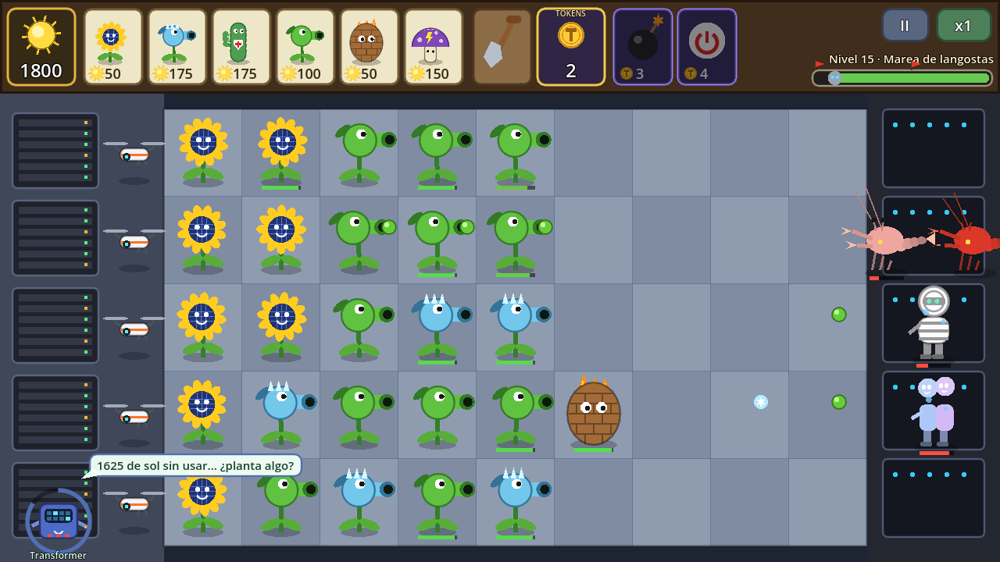
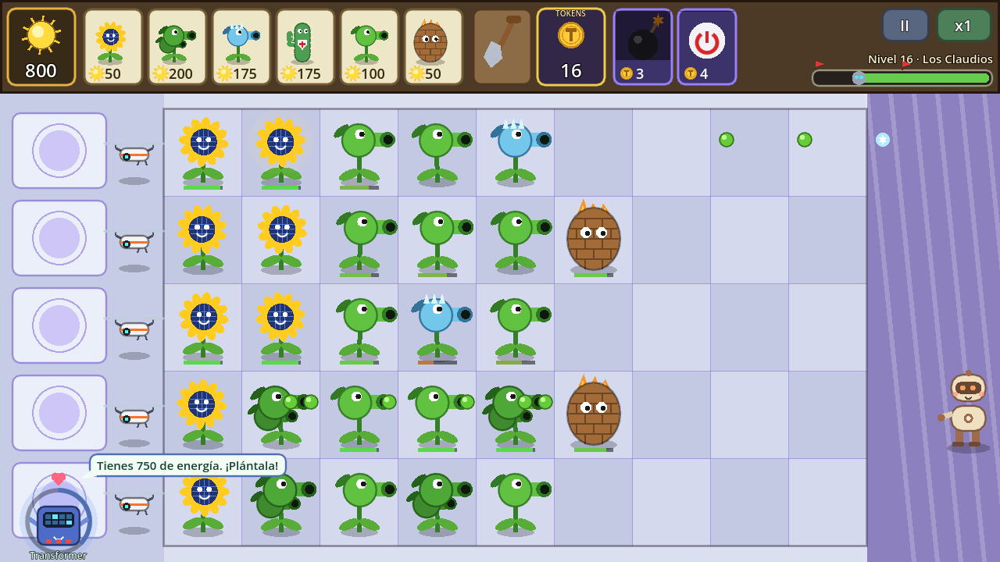
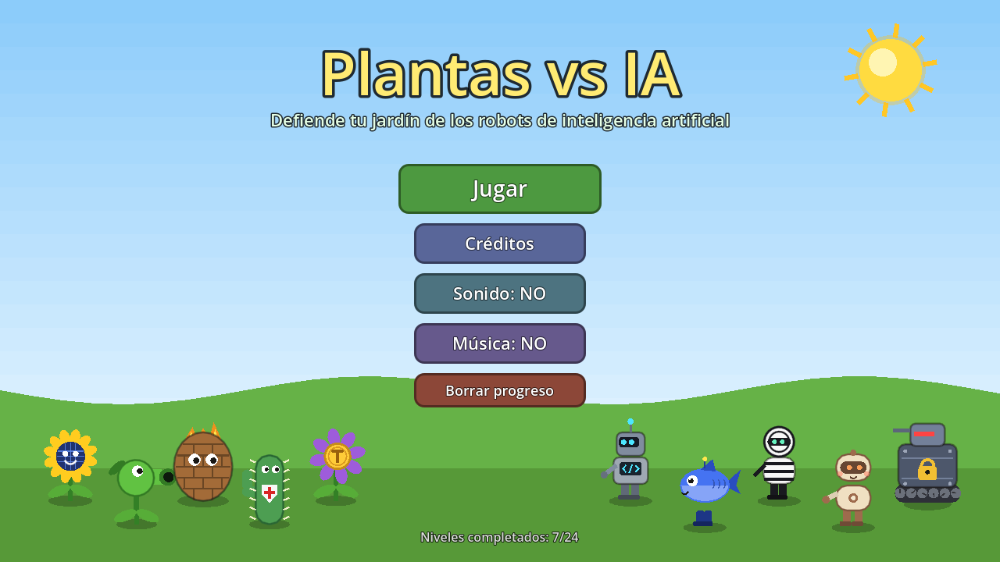

# Plantas vs IA

[Play the game](https://yefry08.github.io/plantas-vs-ia/) · [View source](https://github.com/yefry08/plantas-vs-ia) · [Previous report](https://github.com/SubmitGame/.github/blob/ac433cf234133c9a7fc3efe8a3884f06d3a534b8/games/yefry08--plantas-vs-ia/README.md)

| Overall rating | Screenshot score |
| :---: | :---: |
| **52/100** | **60/100** |

Read the scoring rationale

### Overall rating

Documented scope (15 plants, 22 robots, 6 ally cards, 4 companions, 24 levels in 5 zones, 3-phase boss with 2 endings, procedural art, code-composed music, autotest harness) plus now-verified coherent gameplay frames puts it at fellow tower-defense OSRS Tower Defense (overall 52, screenshots 65, with 12 towers, 61 monsters, 130 waves and denser textured frames) and well above minimal TD Taipo (35, one small map, three towers, sparser 55-scored frames). Verified board readability lifts it above prior 50 no-visuals confidence and above thin-system Kart Royale (50, polished 3D loop but one track). Still well below scope leaders moorestech (64) and GREYWATCH (62) on breadth, visual detail and technical execution. Source and stills do not prove playability, performance, or balance.

### Screenshot score

Both gameplay frames show a coherent readable PvZ-style board with full HUD, varied plants/robots, health bars, projectiles and side panels, clearly the game's own output. Richer and denser than Taipo (screenshot 55, sparse flat map with empty water) but below OSRS Tower Defense (65, textured terrain, winding road, damage numbers, boss bar) and below 3D leaders Kart Royale (70) and GREYWATCH (77) with lighting and depth. Flat procedural vector style with simple shading and flat backgrounds caps polish. Menu frame discounted as non-gameplay. Judged from stills only; no motion or feel inferred.

## At a glance

| Detail | Value |
| --- | --- |
| Repository created | 26 Sep 2026 · 02:28 UTC |
| Added to catalog | 06 Oct 2026 · 15:10 UTC |
| Last updated | 06 Oct 2026 · 15:20 UTC |
| Documented creation models | Not established |

## Screenshots

Inspected 1280x720 gameplay frame Nivel 15 Marea de langostas: 5-lane by 9-column grid with sunflowers, pea shooters, ice shooter, wall-nut, projectiles in flight, green health bars, top HUD with sun 1800, plant cards with costs 50-175, shovel, tokens 2, two AI cards, pause II and x1 buttons, level progress bar, left drone column, right robot roster with locust swarm and two robots, companion Transformer speech bubble. Clearly the game's own runtime output.

[Original screenshot](https://raw.githubusercontent.com/yefry08/plantas-vs-ia/master/docs/gameplay-langostas.png)

Inspected 1280x720 gameplay frame Nivel 16 Los Claudios: same lane-defense layout with sun 800, tokens 16, full plant rows, wall-nuts, green projectiles, health bars, companion speech bubble, one beige robot entering from the right on a lavender zone background. Clearly the game's own runtime output.

[Original screenshot](https://raw.githubusercontent.com/yefry08/plantas-vs-ia/master/docs/gameplay-claudios.png)

Inspected 1280x720 menu frame: title Plantas vs IA, subtitle Defiende tu jardín, buttons Jugar, Créditos, Sonido NO, Música NO, Borrar progreso, Niveles completados 7/24, lineup of five plants and five parody robots on a grassy field. Menu/title card, not active gameplay; discounted for graphics scoring.

[Original screenshot](https://raw.githubusercontent.com/yefry08/plantas-vs-ia/master/docs/menu.png)

## Play

- Open https://yefry08.github.io/plantas-vs-ia/ in a browser; the page loads a Godot 4 web export.
- Pick a plant card at the top (keys 1-6 also work), then tap a board cell to plant it on the 5-lane by 9-column grid.
- Collect falling sun energy and token pickups by tapping them; spend energy on plants and tokens on allied-AI cards.
- Use allied-AI cards by tapping the card then a robot (Q and W are keyboard shortcuts); use the shovel (S) to remove a plant and right-click or Esc to cancel a selection.
- Pause with the II button (Esc or P) and toggle double speed with the x1 button (F); survive the waves across the 24-level campaign and the 3-phase La AGI boss.

## Mechanics

- Lane tower defense on a 5-lane by 9-column grid against waves of AI-parody robots
- Solar energy economy with falling sun pickups, plus per-lane emergency drone, shovel, pause and x2 speed
- 15 plants and 22 robots with per-enemy stats, shields, resistances and special abilities
- 6 allied-AI cards spent with token currency (area damage, shutdown, lane-wide shutdown, alignment, reveal/debuff, cure)
- 4 selectable AI companions with passives and touch-activated abilities plus in-match commentary and warnings
- 24-level campaign across 5 zones plus a final boss, La AGI, with 3 phases and 2 endings
- Bio-Laboratorio zone where AI bioweapons mind-control player plants, countered by the Vacuna card
- Data-driven balance in data/ .tres files with headless script checks and autotest bot modes
- Browser save progress via user:// (IndexedDB on web)

## Tags

- tower-defense
- strategy
- lane-defense
- 2d
- procedural-art
- browser-game
- single-player
- godot

## Controls

- Mobile controls: Supported
- Motion controls: Not established
- Gamepad: Not established
- Keyboard/mouse: Supported

## Player modes

- Human players: 1
- Modes: single-player

## Technologies

- **Godot 4.3** — engine ([evidence](https://raw.githubusercontent.com/yefry08/plantas-vs-ia/master/project.godot))
- **GDScript** — language ([evidence](https://github.com/yefry08/plantas-vs-ia/blob/master/README.md))
- **GL Compatibility** — rendering ([evidence](https://raw.githubusercontent.com/yefry08/plantas-vs-ia/master/project.godot))

## Reconstructed prompt

Build a Plants-vs-Zombies-style lane tower defense in Godot 4 (GDScript) called Plantas vs IA: 5 lanes x 9 columns, solar energy, per-lane emergency drones, shovel, pause and x2 speed; 15 plants, 22 original AI-parody robots, 6 token-cost allied-AI cards and 4 selectable AI companions with passives and tap abilities; a 24-level campaign in 5 zones ending in a 3-phase AGI boss with two endings, including a bioweapon zone that mind-controls plants; 100% procedural vector art, code-generated music and synthesized SFX with zero third-party assets; data-driven .tres content, browser saves, headless autotests, and a thread-free Compatibility-renderer web export for GitHub Pages.

## Source evidence

- Repository page verifies identity: yefry08/plantas-vs-ia, Public, 9 commits, master branch, folders assets/audio/build/data/docs/scenes/scripts/tools plus project.godot and export\_presets.cfg; About text reads Tower defense por carriles en Godot 4: plantas contra robots IA. Jugable en el navegador with homepage yefry08.github.io/plantas-vs-ia. ([source](https://github.com/yefry08/plantas-vs-ia))
- Game identity and scope: lane tower defense in Godot 4 (GDScript) playable in browser; plants defend garden against waves of original parody AI robots with allied AI helping for tokens; 5 lanes x 9 columns, solar energy, per-lane emergency drone, shovel, pause and x2 speed; 15 plants, 22 robots, 6 allied-AI cards, 4 selectable AI companions; 24-level campaign in 5 zones plus final boss La AGI with 3 phases and 2 endings; Bio-Laboratorio mind-control zone; 100% procedural vector art, code-composed music, synthesized SFX, zero third-party assets; data-driven .tres content; progress saved in user:// (IndexedDB on web). ([source](https://github.com/yefry08/plantas-vs-ia/blob/master/README.md))
- Playable web export exists at the linked homepage: page serves a Godot web-export shell (canvas fallback text plus index.png, index.js loader pattern documented in prior run as index.pck and index.wasm with threads disabled); README labels the same URL Jugar en el navegador. ([source](https://yefry08.github.io/plantas-vs-ia/))
- README embeds two real gameplay captures (Nivel 15 Marea de langostas, Nivel 16 Los Claudios) and a main-menu capture, confirming inspectable gameplay frames beyond the default Godot loading splash. ([source](https://github.com/yefry08/plantas-vs-ia))
- Mouse/touch controls supported: action table maps plant choice, planting, pickup collection, AI cards, shovel, pause and speed buttons to Ratón/toque, and states the game can be played end to end with only mouse or touch on mobile. ([source](https://github.com/yefry08/plantas-vs-ia/blob/master/README.md))
- Keyboard controls supported: keys 1-6 select plants; Q and W use AI cards; S uses the shovel; Esc cancels selection; Esc/P pauses; F toggles speed; on-screen II and x1 buttons mirror pause/speed. ([source](https://github.com/yefry08/plantas-vs-ia/blob/master/README.md))
- Touch pipeline config: project.godot sets pointing/emulate\_mouse\_from\_touch=true, consistent with documented mobile-touch playability. ([source](https://raw.githubusercontent.com/yefry08/plantas-vs-ia/master/project.godot))
- Gamepad and motion controls unestablished: no gamepad, accelerometer or gyroscope support is documented in the README, project config, or export instructions; support is not explicitly ruled out. ([source](https://github.com/yefry08/plantas-vs-ia/blob/master/README.md))
- Single-player with 1 human player: documented loop is solo defense of the garden against AI robot waves with an AI ally and token economy, solo 24-level campaign, pause/speed controls and local save; robots and companions are AI opponents/helpers, not human players; no multiplayer mode is documented. ([source](https://github.com/yefry08/plantas-vs-ia/blob/master/README.md))
- Engine and config: project.godot names the app Plantas vs IA, main scene main\_menu.tscn, features 4.3 with GL Compatibility, 1280x720 viewport with canvas\_items/keep stretch, gl\_compatibility renderer, autoloads SaveManager/GameState/AudioManager. ([source](https://raw.githubusercontent.com/yefry08/plantas-vs-ia/master/project.godot))
- Catalog match: games/yefry08--plantas-vs-ia/README.md already references the same repository URL and the same playable URL, so the existing slug is reused; gh CLI was unavailable in the runner (no GH\_TOKEN, not logged in), so public web page and raw.githubusercontent endpoints were used for the same GitHub evidence. ([source](https://github.com/yefry08/plantas-vs-ia))
- Evidence gaps: no live playthrough video, performance, balance, or late-wave verification is available; source files were not cloned or checked out per task constraints, so findings rest on page, README, config, and inspected screenshots only; screenshots do not prove playability, performance, or balance. ([source](https://github.com/yefry08/plantas-vs-ia))
- AI creation models: no model name is explicitly attributed in the inspected README, project config, or repository page; nothing to record. ([source](https://github.com/yefry08/plantas-vs-ia/blob/master/README.md))

## Fictional reviews

Treat these as illustrative, not real user reviews.

- 75/100: Fictional illustrative review: seeing the Nivel 15 locust board clicked for me — full sunflower economy, ice lanes, wall-nut stalls and a chain-shutdown ready in the tray is a proper PvZ-style puzzle.
- 55/100: Fictional illustrative review: the flat emoji-vector art is charming but plain, and without a playthrough I cannot judge pacing or whether 24 levels stay fair into the AGI fight.
- 85/100: Fictional illustrative review: four bantering AI companions, six token cards and a mind-control lab zone on top of data-driven .tres balance — a tiny complete strategy package I want to run in the browser.

## Links

- [Source repository](https://github.com/yefry08/plantas-vs-ia)
- [Play the game](https://yefry08.github.io/plantas-vs-ia/)
- [Source README](https://github.com/yefry08/plantas-vs-ia/blob/master/README.md)
